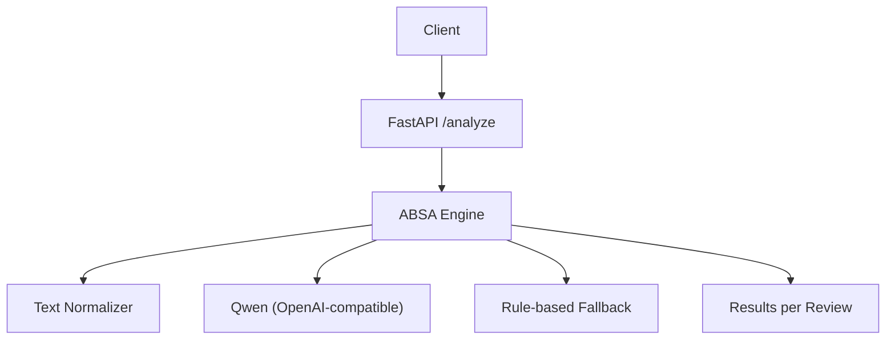
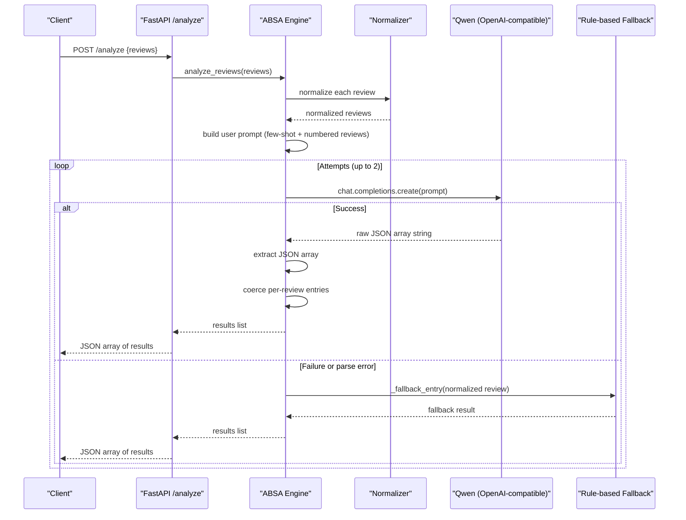
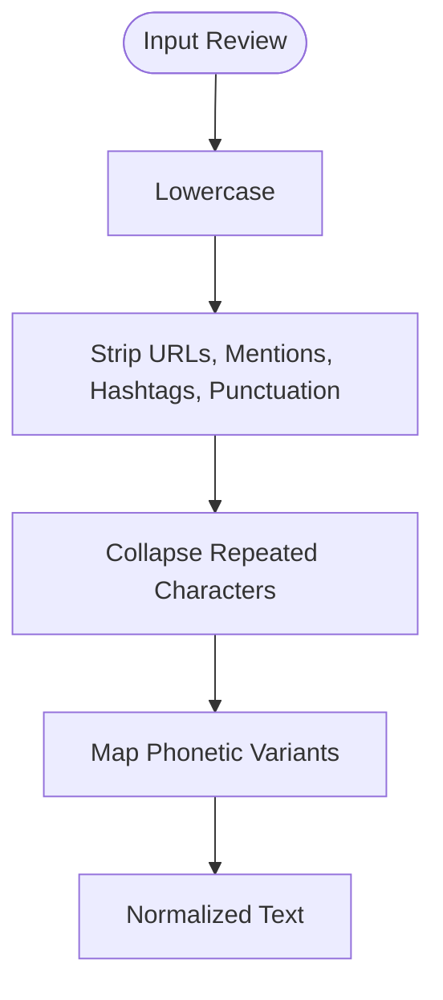
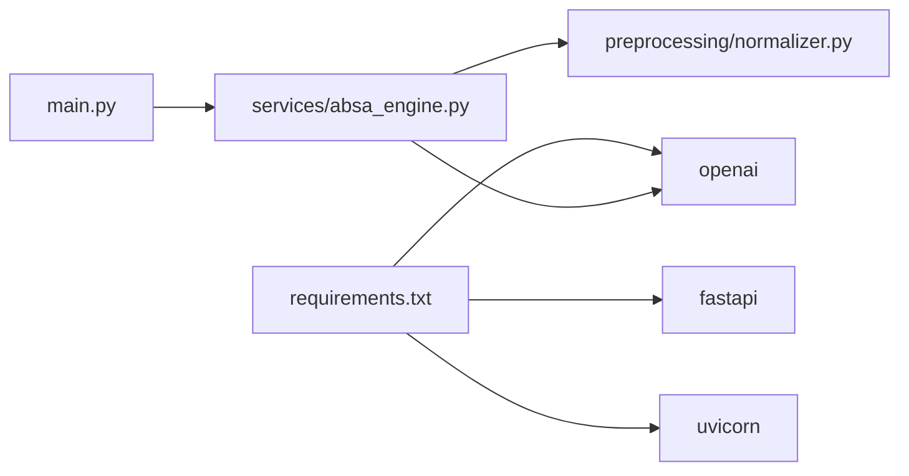

# ABSA Engine

<cite>
**Referenced Files in This Document**
- [main.py](file://main.py)
- [services/absa_engine.py](file://services/absa_engine.py)
- [preprocessing/normalizer.py](file://preprocessing/normalizer.py)
- [data/daraz_reviews_labeled.csv](file://data/daraz_reviews_labeled.csv)
- [requirements.txt](file://requirements.txt)
- [wiki/Home.md](file://wiki/Home.md)
</cite>

## Table of Contents
1. [Introduction](#introduction)
2. [Project Structure](#project-structure)
3. [Core Components](#core-components)
4. [Architecture Overview](#architecture-overview)
5. [Detailed Component Analysis](#detailed-component-analysis)
6. [Dependency Analysis](#dependency-analysis)
7. [Performance Considerations](#performance-considerations)
8. [Troubleshooting Guide](#troubleshooting-guide)
9. [Conclusion](#conclusion)
10. [Appendices](#appendices)

## Introduction
This document explains the Aspect-Based Sentiment Analysis (ABSA) engine that processes Daraz e-commerce reviews written in English, Roman Urdu, or a code-mixed language. The system implements a dual execution path:
- Primary path: LLM-powered analysis via Alibaba Cloud Qwen through an OpenAI-compatible endpoint with few-shot prompting built from real labeled reviews.
- Fallback path: A rule-based mechanism that detects aspects using keyword patterns and assigns sentiment polarity based on local lexicons when the LLM is unavailable or returns malformed output.

The engine accepts batches of up to 10 reviews, normalizes text, constructs prompts, parses structured JSON responses, and applies confidence scoring. It exposes a minimal FastAPI endpoint for integration.

## Project Structure
The repository is organized into clear layers:
- API layer: FastAPI application exposing a single POST /analyze endpoint.
- Core engine: ABSA logic orchestrating normalization, LLM calls, parsing, fallback, and result coercion.
- Preprocessing: Rule-based normalizer for Roman Urdu/code-mixed text.
- Data: Labeled review dataset used for few-shot examples and prompt engineering.
- Documentation: Wiki describing usage and behavior.

**Diagram sources**
- [main.py:16-36](file://main.py#L16-L36)
- [services/absa_engine.py:254-282](file://services/absa_engine.py#L254-L282)
- [preprocessing/normalizer.py:53-65](file://preprocessing/normalizer.py#L53-L65)

**Section sources**
- [main.py:1-36](file://main.py#L1-L36)
- [services/absa_engine.py:1-36](file://services/absa_engine.py#L1-L36)
- [preprocessing/normalizer.py:1-10](file://preprocessing/normalizer.py#L1-L10)
- [wiki/Home.md:1-23](file://wiki/Home.md#L1-L23)

## Core Components
- FastAPI endpoint: Validates input and delegates to the ABSA engine.
- ABSA engine: Orchestrates normalization, prompt construction, LLM invocation, response parsing, fallback, and result coercion.
- Normalizer: Cleans and canonicalizes Roman Urdu/code-mixed text.
- Few-shot examples: Real code-mixed reviews from the dataset used to guide the LLM’s output format and quality.
- Rule-based fallback: Detects aspects via regex and assigns sentiment using positive/negative lexicons within a token window.

Key responsibilities and behaviors are implemented in the ABSA engine, which ensures resilience by retrying LLM calls and falling back to rules when necessary.

**Section sources**
- [main.py:23-36](file://main.py#L23-L36)
- [services/absa_engine.py:38-140](file://services/absa_engine.py#L38-L140)
- [services/absa_engine.py:145-195](file://services/absa_engine.py#L145-L195)
- [services/absa_engine.py:200-249](file://services/absa_engine.py#L200-L249)
- [preprocessing/normalizer.py:23-65](file://preprocessing/normalizer.py#L23-L65)
- [data/daraz_reviews_labeled.csv:1-200](file://data/daraz_reviews_labeled.csv#L1-L200)

## Architecture Overview
The ABSA engine follows a resilient pipeline:
- Input validation and normalization.
- Prompt assembly with few-shot examples.
- LLM call with timeout and one retry.
- Response extraction and coercion into a standardized structure.
- Per-review fallback if model output is invalid.
- Global fallback if all LLM attempts fail or no API key is configured.

**Diagram sources**
- [main.py:32-36](file://main.py#L32-L36)
- [services/absa_engine.py:129-140](file://services/absa_engine.py#L129-L140)
- [services/absa_engine.py:182-195](file://services/absa_engine.py#L182-L195)
- [services/absa_engine.py:254-282](file://services/absa_engine.py#L254-L282)

## Detailed Component Analysis

### Text Normalization
The normalizer prepares noisy, code-mixed reviews for robust processing:
- Lowercasing and noise removal (URLs, mentions, hashtags, emoji, punctuation).
- Collapsing repeated characters to canonical forms.
- Mapping common phonetic variants to standard words (e.g., “bohot” → “bohat”, “qlty” → “quality”).

This step improves both LLM comprehension and rule-based detection accuracy.

**Diagram sources**
- [preprocessing/normalizer.py:53-65](file://preprocessing/normalizer.py#L53-L65)

**Section sources**
- [preprocessing/normalizer.py:1-10](file://preprocessing/normalizer.py#L1-L10)
- [preprocessing/normalizer.py:13-20](file://preprocessing/normalizer.py#L13-L20)
- [preprocessing/normalizer.py:23-50](file://preprocessing/normalizer.py#L23-L50)
- [preprocessing/normalizer.py:53-65](file://preprocessing/normalizer.py#L53-L65)

### Prompt Construction and Few-Shot Learning
The engine builds a compact few-shot prompt using real code-mixed reviews from the dataset:
- System prompt defines task, supported languages, expected output schema, and constraints (raw JSON only).
- Few-shot block includes six examples covering positive, negative, and neutral sentiments with mixed aspects.
- User prompt numbers the input reviews and enforces ordered, structured output matching the number of inputs.

Examples are sourced from specific lines in the dataset to ensure relevance to code-mixed content.

**Section sources**
- [services/absa_engine.py:38-48](file://services/absa_engine.py#L38-L48)
- [services/absa_engine.py:50-117](file://services/absa_engine.py#L50-L117)
- [services/absa_engine.py:120-140](file://services/absa_engine.py#L120-L140)
- [data/daraz_reviews_labeled.csv:1-200](file://data/daraz_reviews_labeled.csv#L1-L200)

### LLM Invocation and Retry Logic
The engine calls Qwen via the OpenAI-compatible client with:
- Configurable base URL and model name.
- Strict timeout and zero internal retries at the client level.
- Application-level retry loop (initial attempt plus one retry).
- Logging of failures and graceful degradation to fallback.

If any attempt fails due to network errors, timeouts, or API issues, the engine logs warnings and proceeds to fallback.

**Section sources**
- [services/absa_engine.py:28-36](file://services/absa_engine.py#L28-L36)
- [services/absa_engine.py:182-195](file://services/absa_engine.py#L182-L195)
- [services/absa_engine.py:254-282](file://services/absa_engine.py#L254-L282)

### Response Parsing and Confidence Scoring
Parsing ensures robust handling of LLM outputs:
- Extracts JSON array from raw text, stripping markdown fences if present.
- Validates that the parsed object is a list.
- Coerces each per-review entry:
  - Ensures aspect names are non-empty strings.
  - Normalizes sentiment to allowed values; defaults to neutral if invalid.
  - Computes confidence by clamping to [0.0, 1.0] and rounding to two decimals; defaults to 0.5 if missing or invalid.
  - If no valid aspects are found, returns a default overall neutral entry with low confidence.

Confidence reflects certainty derived from model output or fallback heuristics.

**Section sources**
- [services/absa_engine.py:145-179](file://services/absa_engine.py#L145-L179)

### Rule-Based Fallback Mechanism
When LLM is unavailable or returns malformed data:
- Aspect detection uses regex patterns for categories like delivery, price, quality, packaging, product, item-as-described, seller service, functionality.
- For each detected aspect, sentiment is determined by counting positive and negative keywords within a ±8-token window around the aspect match.
- If no aspect keywords are found, overall polarity is computed over the entire review.
- Confidence is assigned heuristically (positive/negative at 0.5, neutral at 0.4; overall at 0.35).

This fallback ensures consistent output even under degraded conditions.

**Section sources**
- [services/absa_engine.py:200-249](file://services/absa_engine.py#L200-L249)

### End-to-End Processing Examples
Below are conceptual examples illustrating how different review types flow through both execution paths. These demonstrate behavior without quoting specific code.

- Positive review mentioning sound quality, battery, seller cooperation, and fast delivery:
  - LLM path: extracts multiple aspects with high confidence positive sentiments.
  - Fallback path: detects delivery, quality, and functionality aspects; assigns positive sentiment based on nearby positive keywords.

- Negative review about finishing, mismatched description, and poor remote quality:
  - LLM path: identifies item-as-described and quality-related aspects with negative sentiment.
  - Fallback path: matches item-as-described and functionality patterns; counts negative keywords to assign negative sentiment.

- Mixed review with some positives and negatives across features:
  - LLM path: produces multiple aspects with varied sentiments and moderate confidence.
  - Fallback path: detects relevant aspects and computes polarity from local windows; may yield neutral where positives and negatives balance.

[No sources needed since this section provides conceptual workflows, not direct file analysis]

## Dependency Analysis
The system has minimal external dependencies and clear module boundaries:
- FastAPI and Uvicorn provide the web server and request handling.
- OpenAI client enables communication with Alibaba Cloud Qwen via an OpenAI-compatible endpoint.
- Internal modules encapsulate preprocessing and core ABSA logic.

**Diagram sources**
- [requirements.txt:1-4](file://requirements.txt#L1-L4)
- [main.py:9-12](file://main.py#L9-L12)
- [services/absa_engine.py:17-24](file://services/absa_engine.py#L17-L24)

**Section sources**
- [requirements.txt:1-4](file://requirements.txt#L1-L4)
- [main.py:9-12](file://main.py#L9-L12)
- [services/absa_engine.py:17-24](file://services/absa_engine.py#L17-L24)

## Performance Considerations
- Batch size limit: Up to 10 reviews per request to control payload size and latency.
- Timeout and retries: 30-second timeout per call with one retry to balance responsiveness and reliability.
- Normalization cost: Lightweight regex operations; negligible overhead compared to LLM calls.
- Fallback efficiency: Regex-based aspect detection and simple lexicon scanning are fast and deterministic.
- Scaling considerations:
  - Stateless API design allows horizontal scaling behind a load balancer.
  - Externalize rate limiting and circuit breaking at the gateway level to protect downstream LLM services.
  - Monitor latency and error rates; consider caching frequent prompts or results if appropriate.
  - Use connection pooling and keep-alive for HTTP clients if integrating directly.

[No sources needed since this section provides general guidance]

## Troubleshooting Guide
Common issues and resolutions:
- Missing API key: Without DASHSCOPE_API_KEY, the engine logs a warning and uses rule-based fallback for all requests.
- Network or API errors: Logs capture attempt numbers and exceptions; ensure connectivity and correct base URL/model configuration.
- Malformed LLM output: Parser raises errors if no JSON array is found; per-review coercion falls back to rules when individual entries are invalid.
- Encoding corruption in dataset: The dataset contains replacement characters; the normalizer strips noise, mitigating parsing issues.

Operational checks:
- Verify environment variables: DASHSCOPE_API_KEY, QWEN_MODEL, DASHSCOPE_BASE_URL.
- Validate endpoint: POST /analyze with a small batch to confirm behavior.
- Inspect logs: Look for warnings about failed attempts and fallback usage.

**Section sources**
- [services/absa_engine.py:28-36](file://services/absa_engine.py#L28-L36)
- [services/absa_engine.py:145-179](file://services/absa_engine.py#L145-L179)
- [services/absa_engine.py:254-282](file://services/absa_engine.py#L254-L282)
- [wiki/Home.md:24-30](file://wiki/Home.md#L24-L30)

## Conclusion
The ABSA engine delivers robust aspect-based sentiment analysis for code-mixed reviews through a resilient dual-path design. The primary LLM path leverages few-shot prompting with real dataset examples to produce structured, confident outputs. When the LLM is unavailable or returns invalid results, the rule-based fallback ensures continuity with deterministic aspect detection and sentiment assignment. The system is lightweight, scalable, and designed for production-grade reliability with clear error handling and graceful degradation.

[No sources needed since this section summarizes without analyzing specific files]

## Appendices

### Configuration Reference
- Environment variables:
  - DASHSCOPE_API_KEY: Required for Qwen access.
  - QWEN_MODEL: Optional; defaults to qwen-plus.
  - DASHSCOPE_BASE_URL: Optional; defaults to international OpenAI-compatible endpoint.
- Behavior:
  - Without API key, engine degrades to rule-based fallback.
  - Batch limit enforced at 10 reviews per call.

**Section sources**
- [services/absa_engine.py:28-36](file://services/absa_engine.py#L28-L36)
- [wiki/Home.md:14-23](file://wiki/Home.md#L14-L23)

### Dataset Notes
- The dataset contains encoding artifacts and duplicates; the normalizer handles noise effectively.
- Few-shot examples are selected from representative rows to improve prompt quality for code-mixed content.

**Section sources**
- [wiki/Home.md:32-41](file://wiki/Home.md#L32-L41)
- [data/daraz_reviews_labeled.csv:1-200](file://data/daraz_reviews_labeled.csv#L1-L200)