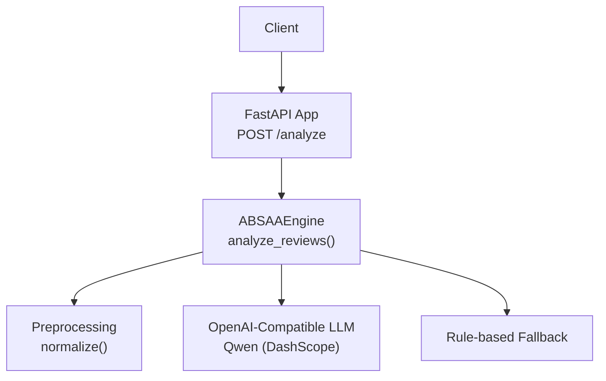
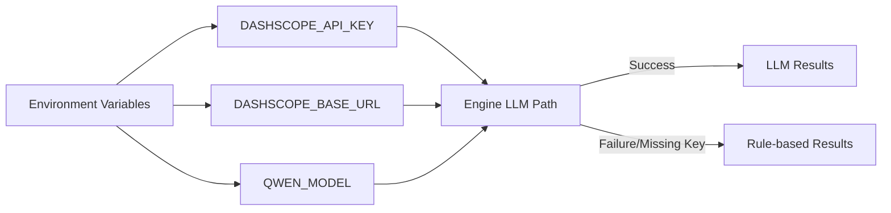
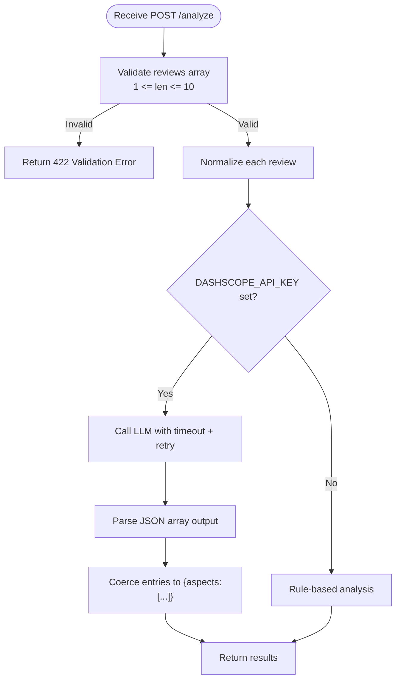

# API Reference

<cite>
**Referenced Files in This Document**
- [main.py](file://main.py)
- [services/absa_engine.py](file://services/absa_engine.py)
- [preprocessing/normalizer.py](file://preprocessing/normalizer.py)
- [requirements.txt](file://requirements.txt)
</cite>

## Table of Contents
1. [Introduction](#introduction)
2. [Project Structure](#project-structure)
3. [Core Components](#core-components)
4. [Architecture Overview](#architecture-overview)
5. [Detailed Component Analysis](#detailed-component-analysis)
6. [Dependency Analysis](#dependency-analysis)
7. [Performance Considerations](#performance-considerations)
8. [Troubleshooting Guide](#troubleshooting-guide)
9. [Conclusion](#conclusion)
10. [Appendices](#appendices)

## Introduction
This document provides the API reference for the RAaye ABSA REST service that performs Aspect-Based Sentiment Analysis (ABSA) on e-commerce reviews written in English, Roman Urdu, or code-mixed text. The service exposes a single POST endpoint to analyze batches of reviews and returns structured aspect-level sentiment with confidence scores. It integrates with an external LLM via an OpenAI-compatible endpoint and includes a resilient rule-based fallback when the model is unavailable.

## Project Structure
The project is organized into:
- A FastAPI application entry point defining the API schema and route
- An ABSA engine module implementing the analysis pipeline, including normalization, LLM calls, and fallback logic
- A preprocessing normalizer for cleaning and canonicalizing review text
- Requirements file listing runtime dependencies



**Diagram sources**
- [main.py:16-36](file://main.py#L16-L36)
- [services/absa_engine.py:254-282](file://services/absa_engine.py#L254-L282)
- [preprocessing/normalizer.py:53-65](file://preprocessing/normalizer.py#L53-L65)

**Section sources**
- [main.py:1-36](file://main.py#L1-L36)
- [services/absa_engine.py:1-36](file://services/absa_engine.py#L1-L36)
- [preprocessing/normalizer.py:1-65](file://preprocessing/normalizer.py#L1-L65)
- [requirements.txt:1-4](file://requirements.txt#L1-L4)

## Core Components
- ABSARequest model: Validates input as a list of review strings with constraints.
- Endpoint: POST /analyze accepts ABSARequest and returns a list of per-review results.
- Engine: Normalizes reviews, attempts LLM call with retries, and falls back to rule-based analysis if needed.
- Normalizer: Cleans and standardizes review text for robust processing.

Key behaviors:
- Batch size limit enforced at both request validation and engine level.
- Each result object contains an aspects array where each item has aspect, sentiment, and confidence fields.
- Authentication uses an environment variable for the external LLM; absence triggers fallback mode.

**Section sources**
- [main.py:23-36](file://main.py#L23-L36)
- [services/absa_engine.py:254-282](file://services/absa_engine.py#L254-L282)
- [preprocessing/normalizer.py:53-65](file://preprocessing/normalizer.py#L53-L65)

## Architecture Overview
The API follows a simple request-response flow with resilience built into the engine layer.

```mermaid
sequenceDiagram
participant C as "Client"
participant F as "FastAPI /analyze"
participant E as "analyze_reviews()"
participant N as "normalize()"
participant O as "OpenAI Qwen"
participant R as "Fallback"
C->>F : POST /analyze {reviews}
F->>E : validate + call analyze_reviews(reviews)
E->>N : normalize each review
alt API key present
loop up to 2 attempts
E->>O : chat.completions(prompt)
O-->>E : JSON array of per-review outputs
E->>E : coerce entries to {aspects : [...]}
E-->>F : results
else all attempts fail
E->>R : rule-based analysis per review
R-->>E : results
E-->>F : results
end
else no API key
E->>R : rule-based analysis per review
R-->>E : results
E-->>F : results
end
F-->>C : 200 OK [results]
```

**Diagram sources**
- [main.py:32-36](file://main.py#L32-L36)
- [services/absa_engine.py:129-195](file://services/absa_engine.py#L129-L195)
- [services/absa_engine.py:220-249](file://services/absa_engine.py#L220-L249)
- [services/absa_engine.py:254-282](file://services/absa_engine.py#L254-L282)

## Detailed Component Analysis

### Endpoint: POST /analyze
- Method: POST
- URL: /analyze
- Request body: JSON object with a reviews field containing an array of strings.
- Response: JSON array of objects, one per input review, preserving order. Each object contains an aspects array where each element has:
  - aspect: string describing the product/service aspect
  - sentiment: one of positive, negative, neutral
  - confidence: number between 0.0 and 1.0

Constraints:
- reviews must be a non-empty array with length between 1 and 10 inclusive.

Validation errors:
- If reviews is empty or exceeds the maximum batch size, the server returns a validation error indicating invalid input.

Example request payload:
- See Appendix for sample JSON structure references.

Example response:
- See Appendix for sample JSON structure references.

Authentication:
- No header authentication is required by the API itself. However, the engine requires DASHSCOPE_API_KEY to call the external LLM. Without it, the service still responds using a rule-based fallback.

**Section sources**
- [main.py:23-36](file://main.py#L23-L36)
- [services/absa_engine.py:254-282](file://services/absa_engine.py#L254-L282)

### ABSARequest Model
- Field: reviews
  - Type: array of strings
  - Constraints: min_length=1, max_length=MAX_BATCH (10)
  - Description: Up to 10 raw reviews per call

Behavior:
- Enforced by Pydantic at the FastAPI layer. Violations produce HTTP 422 Unprocessable Entity responses.

**Section sources**
- [main.py:23-29](file://main.py#L23-L29)
- [services/absa_engine.py:35](file://services/absa_engine.py#L35)

### Engine: analyze_reviews
Responsibilities:
- Validate inputs (non-empty, within batch limits)
- Normalize reviews
- Attempt LLM call with timeout and one retry
- Coerce and validate model output into standardized format
- Fall back to rule-based analysis on failure or missing API key

Error handling:
- Raises ValueError for invalid inputs (empty or too many reviews).
- Logs warnings/errors on LLM failures and proceeds with fallback.

Output guarantees:
- Returns exactly one result object per input review, in the same order.
- Ensures each result has an aspects array with valid sentiment values and bounded confidence.

**Section sources**
- [services/absa_engine.py:254-282](file://services/absa_engine.py#L254-L282)
- [services/absa_engine.py:145-179](file://services/absa_engine.py#L145-L179)

### Preprocessing: normalizer.normalize
Purpose:
- Clean and canonicalize review text to improve downstream analysis stability.

Pipeline highlights:
- Lowercasing
- Removing URLs, mentions, hashtags, punctuation, emoji, and encoding artifacts
- Collapsing repeated characters
- Mapping common phonetic variants to canonical forms

Complexity:
- Linear in the length of the input string due to regex passes and token mapping.

**Section sources**
- [preprocessing/normalizer.py:53-65](file://preprocessing/normalizer.py#L53-L65)

## Dependency Analysis
External dependencies:
- FastAPI and Uvicorn for serving the API
- OpenAI SDK to call DashScope’s OpenAI-compatible endpoint

Environment configuration:
- DASHSCOPE_API_KEY: Required for LLM calls; absence triggers fallback
- DASHSCOPE_BASE_URL: Optional base URL for the compatible endpoint
- QWEN_MODEL: Optional model name selection

Runtime behavior:
- When DASHSCOPE_API_KEY is set, the engine attempts LLM calls with timeouts and retries.
- On failure or missing key, the engine uses a keyword-based rule system to generate results.



**Diagram sources**
- [services/absa_engine.py:28-35](file://services/absa_engine.py#L28-L35)
- [services/absa_engine.py:254-282](file://services/absa_engine.py#L254-L282)

**Section sources**
- [requirements.txt:1-4](file://requirements.txt#L1-L4)
- [services/absa_engine.py:28-35](file://services/absa_engine.py#L28-L35)
- [services/absa_engine.py:254-282](file://services/absa_engine.py#L254-L282)

## Performance Considerations
- Batch size: Use the full allowed batch (up to 10) to amortize overhead across reviews.
- Latency: LLM calls have a configured timeout; expect variability based on network and provider load.
- Resilience: The engine retries once before falling back; this reduces impact of transient failures.
- Normalization cost: Minimal linear-time preprocessing; negligible compared to LLM latency.
- Best practices:
  - Set appropriate client-side timeouts and implement exponential backoff for retries.
  - Cache repeated or near-duplicate reviews if applicable.
  - Monitor error rates and fallback usage to detect provider issues early.

[No sources needed since this section provides general guidance]

## Troubleshooting Guide
Common scenarios:
- Invalid input:
  - Empty reviews array or more than 10 reviews will cause a validation error from the API layer.
  - Expected HTTP status: 422 Unprocessable Entity.
- Rate limiting:
  - Not handled explicitly by the API; depends on the external LLM provider. Implement client-side retry with backoff and respect any rate-limit headers returned by the provider.
- Service unavailability:
  - If the LLM is unreachable or times out, the engine logs a warning and falls back to rule-based analysis. Responses remain valid but may differ in quality.
  - If DASHSCOPE_API_KEY is not set, the engine uses the rule-based path by default.

Operational tips:
- Ensure DASHSCOPE_API_KEY is correctly set in the environment.
- Verify network connectivity to the configured base URL.
- Inspect logs for warnings about failed attempts and fallback usage.

**Section sources**
- [main.py:23-36](file://main.py#L23-L36)
- [services/absa_engine.py:254-282](file://services/absa_engine.py#L254-L282)

## Conclusion
The RAaye ABSA API offers a straightforward interface for aspect-based sentiment analysis over mixed-language reviews. It enforces clear input constraints, returns structured outputs, and provides robust fallback behavior when external services are unavailable. For production use, configure authentication via environment variables, implement client-side retries and backoff, and monitor fallback usage to maintain reliability.

[No sources needed since this section summarizes without analyzing specific files]

## Appendices

### A. Endpoint Specification
- Method: POST
- Path: /analyze
- Request Content-Type: application/json
- Request Body Schema:
  - reviews: array[string], min length 1, max length 10
- Response Schema:
  - array of objects, each with:
    - aspects: array of objects
      - aspect: string
      - sentiment: enum ["positive", "negative", "neutral"]
      - confidence: number in [0.0, 1.0]

**Section sources**
- [main.py:23-36](file://main.py#L23-L36)
- [services/absa_engine.py:157-179](file://services/absa_engine.py#L157-L179)

### B. Example Requests and Responses
- Example request payload:
  - {
      "reviews": [
        "Bohat hi kamal kay Airbird hain sound or bass bohat hi kamal ka hai battery timing bohat achi hai Seller bohat coprative hain delivery timing bohat fast tha thank daraz",
        "Product ki Finishing bilkul Achi nahi hai Glue clear visible hai or side pe white pattern thek se print bhi nahi hua hai."
      ]
    }
- Example response payload:
  - [
      {
        "aspects": [
          {"aspect": "sound quality", "sentiment": "positive", "confidence": 0.95},
          {"aspect": "battery timing", "sentiment": "positive", "confidence": 0.9},
          {"aspect": "seller service", "sentiment": "positive", "confidence": 0.9},
          {"aspect": "delivery", "sentiment": "positive", "confidence": 0.95}
        ]
      },
      {
        "aspects": [
          {"aspect": "finishing", "sentiment": "negative", "confidence": 0.95},
          {"aspect": "item as described", "sentiment": "negative", "confidence": 0.9}
        ]
      }
    ]

Note: These examples reflect the expected shapes derived from the engine’s few-shot data and output coercion logic.

**Section sources**
- [services/absa_engine.py:52-117](file://services/absa_engine.py#L52-L117)
- [services/absa_engine.py:157-179](file://services/absa_engine.py#L157-L179)

### C. Authentication
- Environment variable: DASHSCOPE_API_KEY
- Purpose: Authenticates requests to the external LLM provider (DashScope/OpenAI-compatible endpoint).
- Behavior:
  - If set: Engine attempts LLM calls with timeout and one retry.
  - If not set: Engine uses rule-based fallback and still returns valid results.

**Section sources**
- [services/absa_engine.py:28-35](file://services/absa_engine.py#L28-L35)
- [services/absa_engine.py:254-282](file://services/absa_engine.py#L254-L282)

### D. Error Handling Scenarios
- Invalid input:
  - Empty or oversized reviews array triggers validation error (HTTP 422).
- Rate limiting:
  - Depends on provider; implement client-side retry with backoff and handle 429 responses accordingly.
- Service unavailability:
  - Engine logs warnings and falls back to rule-based analysis; responses remain valid.

**Section sources**
- [main.py:23-36](file://main.py#L23-L36)
- [services/absa_engine.py:254-282](file://services/absa_engine.py#L254-L282)

### E. curl Examples
- Basic request:
  - curl -X POST http://localhost:8000/analyze -H "Content-Type: application/json" -d '{"reviews":["Bohat hi kamal kay Airbird hain sound or bass bohat hi kamal ka hai battery timing bohat achi hai Seller bohat coprative hain delivery timing bohat fast tha thank daraz","Product ki Finishing bilkul Achi nahi hai Glue clear visible hai or side pe white pattern thek se print bhi nahi hua hai."]}'
- With retries and timeout (example):
  - curl --retry 3 --retry-delay 2 --max-time 60 -X POST http://localhost:8000/analyze -H "Content-Type: application/json" -d '{"reviews":["..."]}'

[No sources needed since this section provides general guidance]

### F. Python Client Snippets
- Using requests:
  - import requests
  - payload = {"reviews": ["..."]}
  - response = requests.post("http://localhost:8000/analyze", json=payload, timeout=60)
  - results = response.json()
- Using httpx (async example):
  - import httpx
  - async with httpx.AsyncClient(timeout=60) as client:
  -     resp = await client.post("http://localhost:8000/analyze", json={"reviews": ["..."]})
  -     results = resp.json()

Best practices:
- Implement exponential backoff for retries on 429 or 5xx responses.
- Log and monitor fallback usage to detect provider issues.

[No sources needed since this section provides general guidance]

### G. Data Flow Diagram


**Diagram sources**
- [main.py:23-36](file://main.py#L23-L36)
- [services/absa_engine.py:254-282](file://services/absa_engine.py#L254-L282)
- [services/absa_engine.py:145-179](file://services/absa_engine.py#L145-L179)