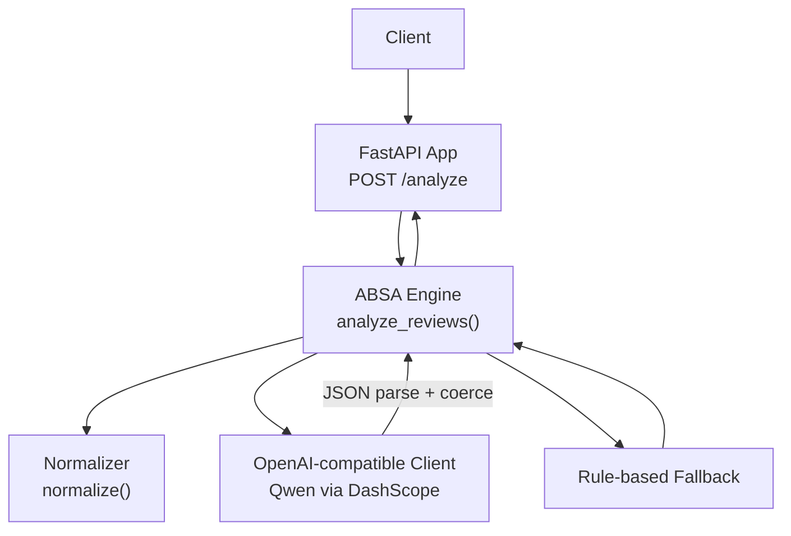
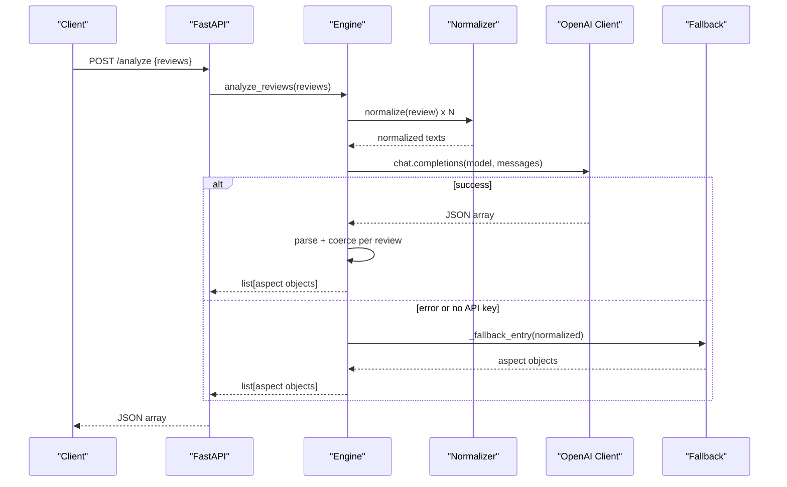

# Configuration and Deployment

<cite>
**Referenced Files in This Document**
- [main.py](file://main.py)
- [requirements.txt](file://requirements.txt)
- [services/absa_engine.py](file://services/absa_engine.py)
- [preprocessing/normalizer.py](file://preprocessing/normalizer.py)
- [wiki/Home.md](file://wiki/Home.md)
</cite>

## Table of Contents
1. [Introduction](#introduction)
2. [Project Structure](#project-structure)
3. [Core Components](#core-components)
4. [Architecture Overview](#architecture-overview)
5. [Detailed Component Analysis](#detailed-component-analysis)
6. [Environment Variables](#environment-variables)
7. [Containerization with Docker](#containerization-with-docker)
8. [Kubernetes Deployment](#kubernetes-deployment)
9. [Monitoring and Logging](#monitoring-and-logging)
10. [Scaling and Load Balancing](#scaling-and-load-balancing)
11. [Security Considerations](#security-considerations)
12. [Performance Optimization](#performance-optimization)
13. [CI/CD Pipeline](#cicd-pipeline)
14. [Automated Testing Strategy](#automated-testing-strategy)
15. [Troubleshooting Guide](#troubleshooting-guide)
16. [Conclusion](#conclusion)

## Introduction
This document provides production-focused configuration and deployment guidance for the RAaye ABSA service. It covers environment variables, containerization, Kubernetes manifests, monitoring/logging, scaling strategies, security, performance tuning, CI/CD, and testing. The service is a minimal FastAPI application that performs aspect-based sentiment analysis on Roman Urdu/code-mixed reviews using Alibaba Cloud Model Studio (Qwen) via an OpenAI-compatible endpoint, with a resilient fallback to a rule-based analyzer when the model is unavailable.

## Project Structure
The project is organized into a small set of focused modules:
- API entrypoint exposing a single POST endpoint for batched review analysis
- ABSA engine orchestrating normalization, LLM calls, parsing, validation, and fallback logic
- Preprocessing normalizer for cleaning and canonicalizing input text
- Requirements file declaring runtime dependencies
- Wiki page summarizing behavior and usage

**Diagram sources**
- [main.py:16-36](file://main.py#L16-L36)
- [services/absa_engine.py:254-282](file://services/absa_engine.py#L254-L282)
- [preprocessing/normalizer.py:53-65](file://preprocessing/normalizer.py#L53-L65)

**Section sources**
- [main.py:1-36](file://main.py#L1-L36)
- [services/absa_engine.py:1-37](file://services/absa_engine.py#L1-L37)
- [preprocessing/normalizer.py:1-12](file://preprocessing/normalizer.py#L1-L12)
- [wiki/Home.md:1-22](file://wiki/Home.md#L1-L22)

## Core Components
- FastAPI app: defines request schema and exposes the analyze endpoint.
- ABSA engine: builds prompts, calls Qwen with timeout and retry, parses JSON output, coerces results, and falls back to keyword-based analysis if needed.
- Normalizer: cleans and canonicalizes Roman Urdu/code-mixed text before analysis.
- Dependencies: FastAPI, Uvicorn, OpenAI SDK.

Key behaviors:
- Batch size limit enforced at the API and engine layers.
- Graceful degradation to rule-based fallback when API key is missing or model calls fail.
- Strict output coercion to ensure consistent response shape.

**Section sources**
- [main.py:23-36](file://main.py#L23-L36)
- [services/absa_engine.py:28-37](file://services/absa_engine.py#L28-L37)
- [services/absa_engine.py:145-179](file://services/absa_engine.py#L145-L179)
- [services/absa_engine.py:220-249](file://services/absa_engine.py#L220-L249)
- [services/absa_engine.py:254-282](file://services/absa_engine.py#L254-L282)
- [preprocessing/normalizer.py:53-65](file://preprocessing/normalizer.py#L53-L65)
- [requirements.txt:1-4](file://requirements.txt#L1-L4)

## Architecture Overview
The service follows a simple request pipeline:
1. Client sends a POST request with up to N reviews.
2. FastAPI validates input and invokes the engine.
3. Engine normalizes each review and constructs a prompt.
4. Engine calls Qwen with configured base URL and model; retries once on failure.
5. Output is parsed and coerced; per-review errors fall back to rule-based analysis.
6. Results are returned in order matching the input.

**Diagram sources**
- [main.py:32-36](file://main.py#L32-L36)
- [services/absa_engine.py:182-195](file://services/absa_engine.py#L182-L195)
- [services/absa_engine.py:254-282](file://services/absa_engine.py#L254-L282)
- [preprocessing/normalizer.py:53-65](file://preprocessing/normalizer.py#L53-L65)

## Detailed Component Analysis

### FastAPI Endpoint
- Defines a Pydantic request model enforcing minimum and maximum batch sizes.
- Exposes a single POST route that delegates to the engine.

Operational notes:
- Keep the endpoint stateless to support horizontal scaling.
- Use reverse proxies/load balancers for TLS termination and rate limiting.

**Section sources**
- [main.py:23-36](file://main.py#L23-L36)

### ABSA Engine
Responsibilities:
- Reads environment configuration for API key, base URL, and model.
- Builds a few-shot prompt and calls the OpenAI-compatible client with a fixed timeout.
- Parses raw model output into a JSON array and coerces entries to a strict schema.
- Implements a robust rule-based fallback when the model is unavailable or returns malformed data.

Resilience:
- Configured attempts include initial call plus one retry.
- Per-review coercion errors are handled individually without failing the entire batch.

Complexity considerations:
- Prompt construction scales linearly with batch size.
- Parsing and coercion are O(N) over the number of reviews.

**Section sources**
- [services/absa_engine.py:28-37](file://services/absa_engine.py#L28-L37)
- [services/absa_engine.py:120-140](file://services/absa_engine.py#L120-L140)
- [services/absa_engine.py:145-179](file://services/absa_engine.py#L145-L179)
- [services/absa_engine.py:182-195](file://services/absa_engine.py#L182-L195)
- [services/absa_engine.py:220-249](file://services/absa_engine.py#L220-L249)
- [services/absa_engine.py:254-282](file://services/absa_engine.py#L254-L282)

### Normalizer
- Cleans noise (URLs, mentions, hashtags, punctuation, emoji).
- Collapses repeated characters and maps phonetic variants to canonical forms.
- Produces lowercase token sequences suitable for downstream processing.

Performance:
- Regex operations and dictionary lookups are efficient for typical review lengths.
- Suitable for in-process execution within worker processes.

**Section sources**
- [preprocessing/normalizer.py:13-20](file://preprocessing/normalizer.py#L13-L20)
- [preprocessing/normalizer.py:23-50](file://preprocessing/normalizer.py#L23-L50)
- [preprocessing/normalizer.py:53-65](file://preprocessing/normalizer.py#L53-L65)

## Environment Variables
The service uses environment variables only for configuration. All values must be provided at runtime.

- DASHSCOPE_API_KEY
  - Purpose: Required authentication key for calling Qwen via the OpenAI-compatible endpoint.
  - Valid values: A non-empty string representing your DashScope API key.
  - Behavior: If unset or empty, the service degrades to rule-based fallback.

- QWEN_MODEL
  - Purpose: Selects the model used for ABSA inference.
  - Valid values: A model identifier supported by the configured base URL (e.g., qwen-plus).
  - Default: qwen-plus.

- DASHSCOPE_BASE_URL
  - Purpose: Base URL for the OpenAI-compatible endpoint.
  - Valid values: A valid HTTPS endpoint URL compatible with the OpenAI chat completions interface.
  - Default: https://dashscope-intl.aliyuncs.com/compatible-mode/v1.

Additional runtime settings (hardcoded in code):
- TIMEOUT_SECONDS: Request timeout for model calls.
- ATTEMPTS: Number of attempts including retries.
- MAX_BATCH: Maximum number of reviews per request.

Recommendations:
- Store secrets in a secure secret manager (e.g., Kubernetes Secrets, cloud secret stores).
- Validate presence of DASHSCOPE_API_KEY during startup; fail fast if required but missing.
- Pin QWEN_MODEL to a specific version or alias to avoid unexpected changes.

**Section sources**
- [services/absa_engine.py:28-37](file://services/absa_engine.py#L28-L37)
- [wiki/Home.md:22-22](file://wiki/Home.md#L22-L22)

## Containerization with Docker
Create a lightweight image that installs Python dependencies and runs the FastAPI server.

Recommended steps:
- Use a slim Python base image.
- Copy requirements.txt and install dependencies.
- Copy application code.
- Expose the HTTP port used by Uvicorn.
- Set environment variables via orchestration (not baked into the image).

Example Dockerfile outline:
- FROM python:slim
- WORKDIR /app
- COPY requirements.txt .
- RUN pip install --no-cache-dir -r requirements.txt
- COPY . .
- CMD ["uvicorn", "main:app", "--host", "0.0.0.0", "--port", "8000"]

Notes:
- Do not embed secrets in images.
- Use multi-stage builds if you add build-time tools.
- Ensure health checks probe the /health or root endpoint if you add one.

**Section sources**
- [requirements.txt:1-4](file://requirements.txt#L1-L4)
- [main.py:1-5](file://main.py#L1-L5)

## Kubernetes Deployment
Deploy the service as a stateless workload behind a Service and optional Ingress.

Recommended resources:
- Deployment: define replicas, resource requests/limits, liveness/readiness probes, and env vars from Secrets/ConfigMaps.
- Service: ClusterIP to expose the app internally.
- Ingress: TLS termination and path routing to the Service.
- HorizontalPodAutoscaler: scale based on CPU/memory or custom metrics.

Configuration tips:
- Mount secrets for DASHSCOPE_API_KEY.
- Provide QWEN_MODEL and DASHSCOPE_BASE_URL via ConfigMap or env.
- Set appropriate resource limits to prevent noisy neighbor issues.
- Use PodDisruptionBudgets for safe rolling updates.

Health endpoints:
- Add a simple GET /health returning 200 OK to enable readiness/liveness probes.

**Section sources**
- [main.py:16-20](file://main.py#L16-L20)
- [services/absa_engine.py:28-37](file://services/absa_engine.py#L28-L37)

## Monitoring and Logging
Logging:
- The app configures basic logging at INFO level.
- Log warnings/errors around model failures and fallback usage.

Recommendations:
- Centralize logs with a log aggregator (e.g., Fluent Bit + Loki/Elasticsearch).
- Add structured logging (JSON) for easier querying.
- Correlate requests with trace IDs.

Metrics:
- Expose Prometheus metrics for request rates, latency percentiles, error rates, and queue depth if added later.
- Track fallback usage as a business metric.

Alerting:
- Alert on high error rates, increased fallback usage, and elevated p95/p99 latencies.
- Alert on upstream API errors from the model provider.

**Section sources**
- [main.py:7-14](file://main.py#L7-L14)
- [services/absa_engine.py:26-26](file://services/absa_engine.py#L26-L26)
- [services/absa_engine.py:276-280](file://services/absa_engine.py#L276-L280)

## Scaling and Load Balancing
Horizontal scaling:
- Run multiple replicas behind a load balancer.
- Use HPA to auto-scale based on CPU utilization or custom metrics like requests per second.

Load balancing:
- Use a reverse proxy (NGINX/Envoy) or managed Ingress for TLS termination, connection pooling, and rate limiting.
- Configure keep-alive and timeouts appropriately.

Batch sizing:
- Enforce MAX_BATCH at the API layer to control payload size and memory usage.
- Tune client-side batching to balance throughput and latency.

Backpressure:
- Implement request queuing or circuit breakers if upstream becomes unstable.
- Return clear error codes and messages for rate-limited or overloaded states.

**Section sources**
- [main.py:23-29](file://main.py#L23-L29)
- [services/absa_engine.py:33-35](file://services/absa_engine.py#L33-L35)

## Security Considerations
Secrets management:
- Never hardcode DASHSCOPE_API_KEY. Use environment variables injected from a secure secret store.
- Rotate keys regularly and audit access.

Input validation:
- Enforce batch size limits and sanitize inputs at the API boundary.
- Reject excessively long payloads to prevent abuse.

Rate limiting:
- Apply rate limiting at the ingress/proxy layer to protect against abuse and upstream throttling.
- Consider per-client quotas if serving multiple tenants.

Transport security:
- Terminate TLS at the edge and enforce HTTPS.
- Use internal mTLS between services if added later.

Least privilege:
- Run containers as non-root where possible.
- Restrict network egress to required endpoints only.

**Section sources**
- [main.py:23-29](file://main.py#L23-L29)
- [services/absa_engine.py:28-32](file://services/absa_engine.py#L28-L32)

## Performance Optimization
Request handling:
- Use Uvicorn workers tuned to available CPU cores.
- Enable gzip compression at the proxy layer.

Model calls:
- Tune TIMEOUT_SECONDS and ATTEMPTS based on observed latency and reliability.
- Cache frequent prompts or reuse client connections where applicable.

Parsing and coercion:
- Keep parsing strict to fail fast on malformed outputs.
- Minimize allocations in hot paths.

Normalization:
- The regex-based normalizer is efficient; consider precompiling patterns if further optimization is needed.

Observability:
- Instrument latency histograms and error counters.
- Monitor fallback frequency to detect upstream issues early.

**Section sources**
- [main.py:1-5](file://main.py#L1-L5)
- [services/absa_engine.py:33-35](file://services/absa_engine.py#L33-L35)
- [services/absa_engine.py:145-179](file://services/absa_engine.py#L145-L179)
- [preprocessing/normalizer.py:13-20](file://preprocessing/normalizer.py#L13-L20)

## CI/CD Pipeline
Pipeline stages:
- Lint and type check
- Unit tests
- Build container image
- Push to registry
- Deploy to staging with canary or blue/green strategy
- Smoke tests against staging
- Promote to production

Automation:
- Tag images with commit SHA and semantic version.
- Use immutable artifacts and signed images.
- Enforce branch protection and required approvals.

Example workflow outline:
- On push: run lint, tests, build, and push image.
- On tag: deploy to staging, run integration tests, then promote to production after approval.

**Section sources**
- [requirements.txt:1-4](file://requirements.txt#L1-L4)
- [wiki/Home.md:1-22](file://wiki/Home.md#L1-L22)

## Automated Testing Strategy
Unit tests:
- Test normalizer transformations with known inputs and expected outputs.
- Test request validation for invalid payloads.
- Mock external model calls to validate parsing and coercion logic.

Integration tests:
- Spin up a test instance with a mock or sandbox endpoint.
- Validate end-to-end flows including fallback behavior.

Contract tests:
- Verify response schema matches documented structure.

Test data:
- Use representative samples from the dataset to cover edge cases (mixed sentiments, noise, truncation).

**Section sources**
- [preprocessing/normalizer.py:68-90](file://preprocessing/normalizer.py#L68-L90)
- [main.py:23-36](file://main.py#L23-L36)
- [services/absa_engine.py:145-179](file://services/absa_engine.py#L145-L179)

## Troubleshooting Guide
Common issues and resolutions:
- Missing API key:
  - Symptom: Service always uses rule-based fallback.
  - Action: Ensure DASHSCOPE_API_KEY is set and accessible to the process.

- Upstream errors or timeouts:
  - Symptom: Increased fallback usage, higher latency.
  - Action: Check DASHSCOPE_BASE_URL and QWEN_MODEL; adjust TIMEOUT_SECONDS and ATTEMPTS; monitor upstream status.

- Malformed model output:
  - Symptom: Warnings about bad model output; per-review fallback triggered.
  - Action: Inspect prompt and model version; tighten parsing; add more robust error handling.

- High memory/CPU usage:
  - Symptom: Pods evicted or throttled.
  - Action: Tune replica count, worker processes, and resource limits; reduce batch size.

- Rate limiting:
  - Symptom: 429 responses or degraded performance.
  - Action: Implement client-side backoff; configure rate limits at ingress; consider upgrading model tier.

Diagnostics:
- Review logs for warnings and errors around model calls and fallback.
- Collect metrics for latency, error rates, and fallback frequency.
- Use distributed tracing to identify bottlenecks.

**Section sources**
- [services/absa_engine.py:263-282](file://services/absa_engine.py#L263-L282)
- [main.py:7-14](file://main.py#L7-L14)

## Conclusion
The RAaye ABSA service is a compact, resilient system that combines LLM-powered analysis with a reliable fallback. For production, focus on secure secret management, robust monitoring/logging, horizontal scaling, and strong input validation. Use the environment variables defined above to configure the service, containerize it consistently, and deploy with Kubernetes for elasticity and reliability. Continuously observe performance and adapt scaling policies to meet throughput and latency targets.