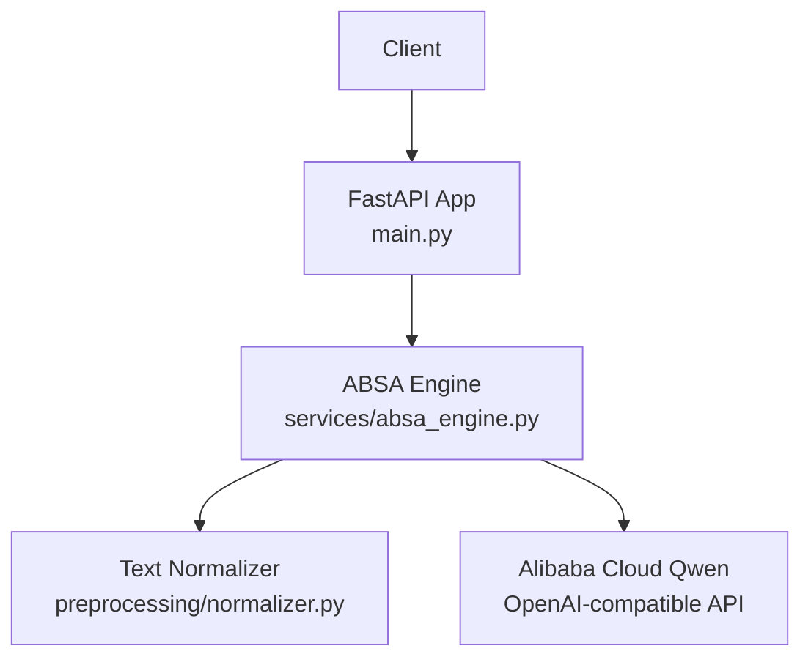
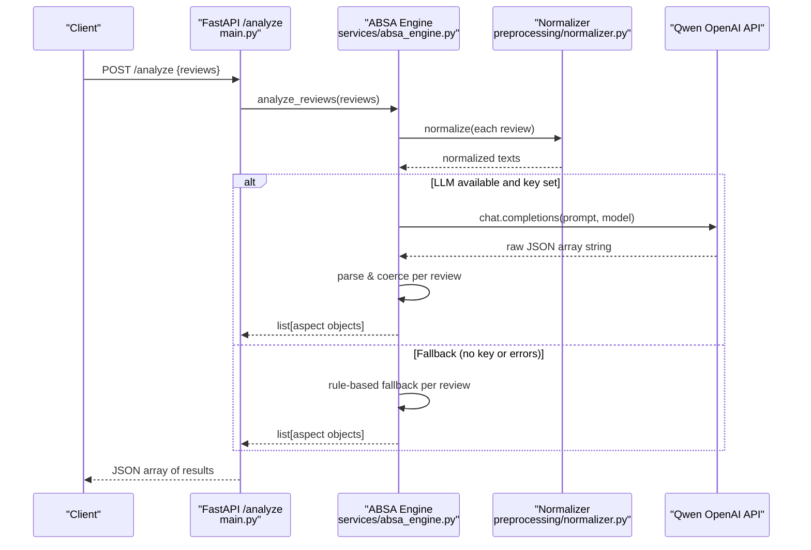
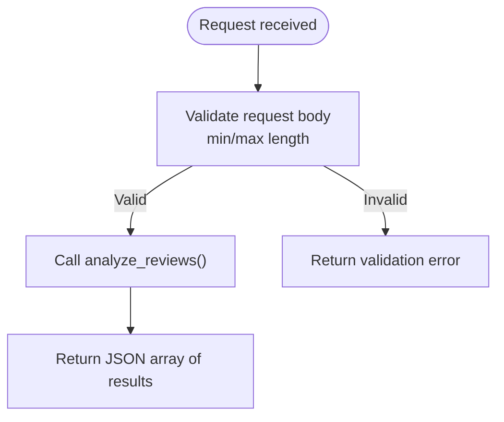
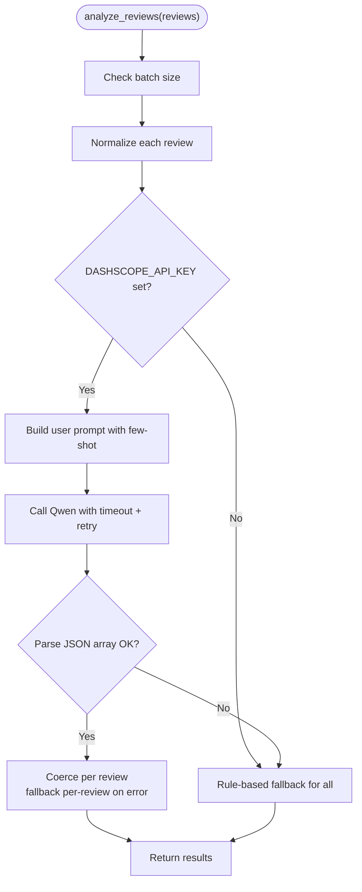
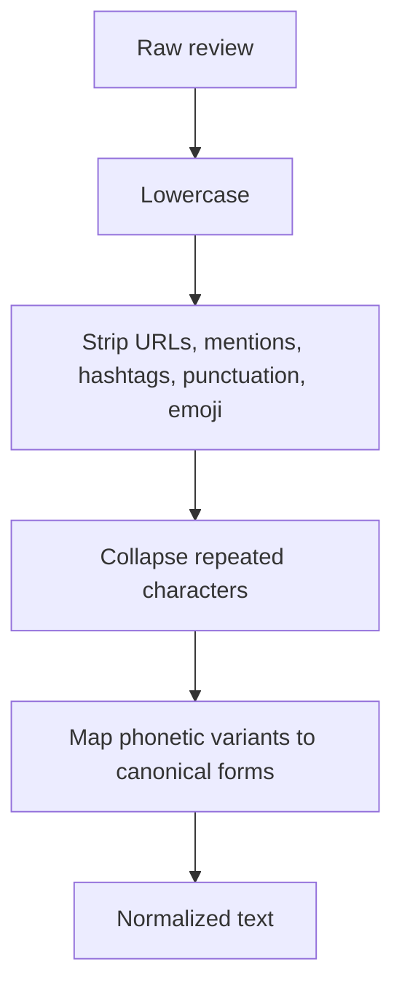
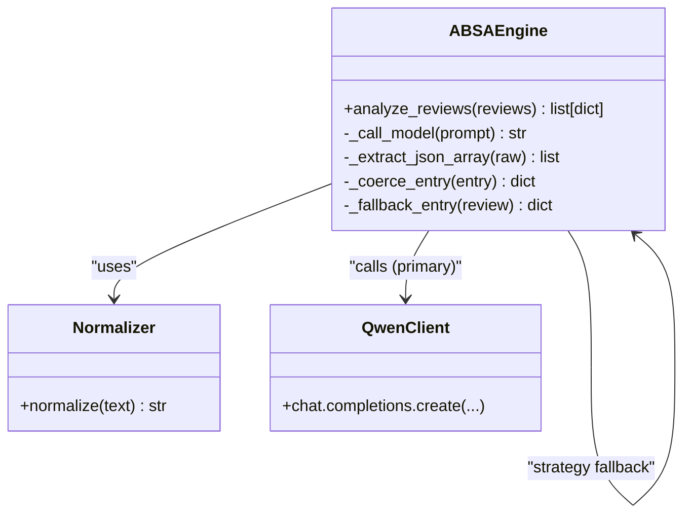
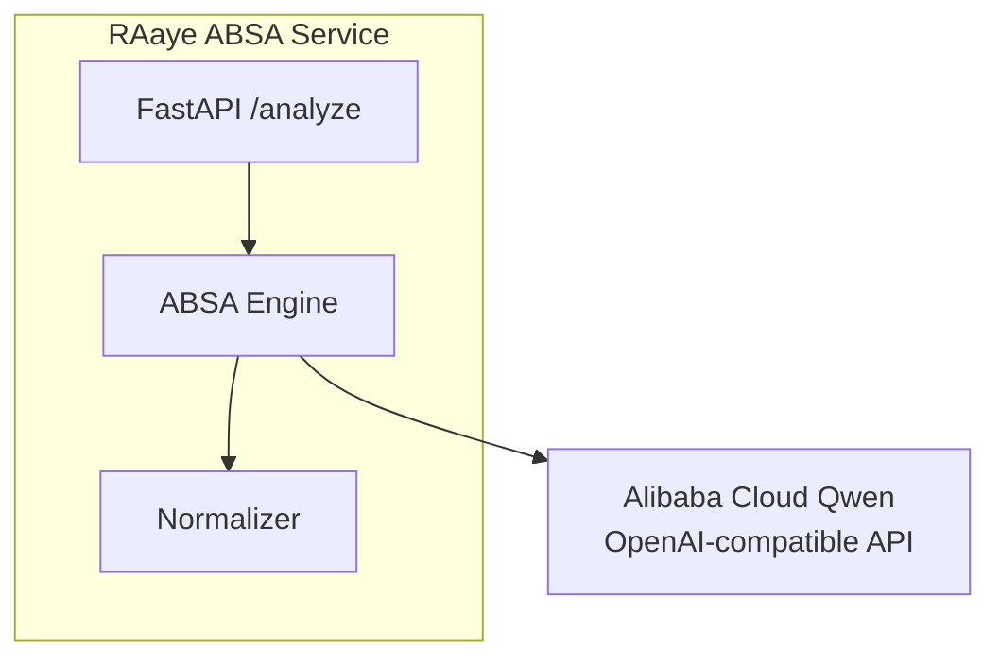
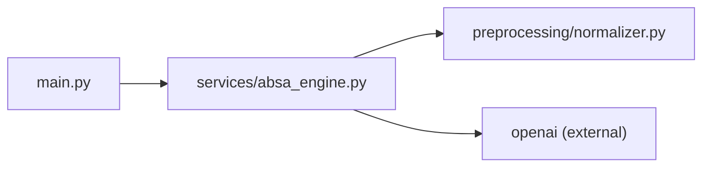

# Core Architecture

<cite>
**Referenced Files in This Document**
- [main.py](file://main.py)
- [services/absa_engine.py](file://services/absa_engine.py)
- [preprocessing/normalizer.py](file://preprocessing/normalizer.py)
- [requirements.txt](file://requirements.txt)
- [wiki/Home.md](file://wiki/Home.md)
</cite>

## Table of Contents
1. [Introduction](#introduction)
2. [Project Structure](#project-structure)
3. [Core Components](#core-components)
4. [Architecture Overview](#architecture-overview)
5. [Detailed Component Analysis](#detailed-component-analysis)
6. [Dependency Analysis](#dependency-analysis)
7. [Performance Considerations](#performance-considerations)
8. [Troubleshooting Guide](#troubleshooting-guide)
9. [Conclusion](#conclusion)

## Introduction
This document describes the architecture of the RAaye ABSA system, an aspect-based sentiment analysis service for e-commerce reviews written in English, Roman Urdu, or code-mixed text. The system exposes a minimal FastAPI endpoint that accepts batches of reviews, normalizes them, and performs ABSA using a dual execution path: a primary LLM-based path via Alibaba Cloud Qwen (OpenAI-compatible API) with retry, and a rule-based fallback when the LLM is unavailable or returns malformed output.

The design emphasizes resilience, simplicity, and clear microservice boundaries:
- Application layer: FastAPI HTTP interface
- Business logic layer: ABSA engine orchestrating normalization, LLM calls, and fallback
- Preprocessing layer: Rule-based text normalization for Roman Urdu/code-mix

## Project Structure
The repository is organized by functional layers:
- Application entry point and API schema
- Engine implementing the ABSA workflow and external integration
- Preprocessing module for text normalization
- Documentation and dependency declarations

**Diagram sources**
- [main.py:16-36](file://main.py#L16-L36)
- [services/absa_engine.py:254-282](file://services/absa_engine.py#L254-L282)
- [preprocessing/normalizer.py:53-65](file://preprocessing/normalizer.py#L53-L65)

**Section sources**
- [main.py:1-36](file://main.py#L1-L36)
- [services/absa_engine.py:1-36](file://services/absa_engine.py#L1-L36)
- [preprocessing/normalizer.py:1-10](file://preprocessing/normalizer.py#L1-L10)
- [requirements.txt:1-4](file://requirements.txt#L1-L4)
- [wiki/Home.md:1-23](file://wiki/Home.md#L1-L23)

## Core Components
- FastAPI application layer: Defines request/response models and a single POST /analyze endpoint. It delegates processing to the ABSA engine.
- ABSA engine: Orchestrates preprocessing, builds prompts, calls Qwen via OpenAI-compatible client with timeout and retry, parses JSON responses, coerces entries, and falls back to rule-based analysis if needed.
- Preprocessing normalizer: Cleans and canonicalizes Roman Urdu/code-mixed text through lowercase conversion, noise removal, repetition collapsing, and variant mapping.

Key responsibilities and interactions:
- Request validation at the API boundary ensures batch size constraints.
- Normalization standardizes input before any analysis.
- LLM path uses few-shot prompting and strict JSON parsing; per-review coercion handles partial failures.
- Fallback path provides deterministic results using keyword detection and lexicon polarity.

**Section sources**
- [main.py:23-36](file://main.py#L23-L36)
- [services/absa_engine.py:254-282](file://services/absa_engine.py#L254-L282)
- [preprocessing/normalizer.py:53-65](file://preprocessing/normalizer.py#L53-L65)

## Architecture Overview
The system follows a layered architecture with clear separation of concerns and a resilient dual execution path.

**Diagram sources**
- [main.py:32-36](file://main.py#L32-L36)
- [services/absa_engine.py:254-282](file://services/absa_engine.py#L254-L282)
- [preprocessing/normalizer.py:53-65](file://preprocessing/normalizer.py#L53-L65)

## Detailed Component Analysis

### FastAPI Application Layer
- Endpoint: POST /analyze accepts a validated request body with a list of reviews constrained to a maximum batch size.
- Response: Returns a JSON array where each element corresponds to one input review, preserving order.
- Validation: Uses Pydantic to enforce non-empty lists and batch limits, reducing invalid traffic to downstream components.

**Diagram sources**
- [main.py:23-36](file://main.py#L23-L36)

**Section sources**
- [main.py:23-36](file://main.py#L23-L36)

### ABSA Engine (Business Logic Layer)
Responsibilities:
- Prompt construction with few-shot examples tailored to code-mixed reviews
- External call to Qwen via OpenAI-compatible client with configured timeout and retries
- Robust parsing and coercion of model output into standardized per-review structures
- Deterministic rule-based fallback when LLM is unavailable or output is malformed

Execution flow:
- Normalize all inputs first
- If API key present, attempt LLM call with up to two attempts
- Parse response into a list; coerce each review’s aspects, falling back per-review on coercion errors
- If LLM fails entirely or no API key, use rule-based fallback for all reviews

**Diagram sources**
- [services/absa_engine.py:254-282](file://services/absa_engine.py#L254-L282)
- [services/absa_engine.py:182-195](file://services/absa_engine.py#L182-L195)
- [services/absa_engine.py:145-179](file://services/absa_engine.py#L145-L179)
- [services/absa_engine.py:220-249](file://services/absa_engine.py#L220-L249)

**Section sources**
- [services/absa_engine.py:1-36](file://services/absa_engine.py#L1-L36)
- [services/absa_engine.py:120-140](file://services/absa_engine.py#L120-L140)
- [services/absa_engine.py:145-179](file://services/absa_engine.py#L145-L179)
- [services/absa_engine.py:182-195](file://services/absa_engine.py#L182-L195)
- [services/absa_engine.py:200-249](file://services/absa_engine.py#L200-L249)
- [services/absa_engine.py:254-282](file://services/absa_engine.py#L254-L282)

### Preprocessing Layer (Text Normalizer)
Purpose:
- Convert raw reviews into clean, canonical tokens suitable for both LLM and rule-based analysis
- Handle common issues in Roman Urdu/code-mixed text: URLs, mentions, emoji, punctuation, repeated characters, phonetic variants

Pipeline steps:
- Lowercase conversion
- Remove URLs, mentions, hashtags (keep hashtag content), punctuation/emoji/garbage
- Collapse repeated characters
- Map common phonetic spelling variants to canonical forms

**Diagram sources**
- [preprocessing/normalizer.py:53-65](file://preprocessing/normalizer.py#L53-L65)

**Section sources**
- [preprocessing/normalizer.py:13-50](file://preprocessing/normalizer.py#L13-L50)
- [preprocessing/normalizer.py:53-65](file://preprocessing/normalizer.py#L53-L65)

### Dual Execution Path Design Pattern (Strategy Pattern)
The engine implements a strategy-like pattern with two interchangeable strategies:
- LLM Strategy: Primary path using Qwen via OpenAI-compatible API with few-shot prompting, timeouts, and retries
- Rule-Based Strategy: Fallback path using keyword detection and lexicon polarity

Decision logic:
- If API key is set, attempt LLM strategy with retries; per-review coercion allows partial fallbacks within the same request
- If API key is not set or all attempts fail, switch to rule-based strategy for all reviews

**Diagram sources**
- [services/absa_engine.py:254-282](file://services/absa_engine.py#L254-L282)
- [services/absa_engine.py:182-195](file://services/absa_engine.py#L182-L195)
- [services/absa_engine.py:220-249](file://services/absa_engine.py#L220-L249)
- [preprocessing/normalizer.py:53-65](file://preprocessing/normalizer.py#L53-L65)

**Section sources**
- [services/absa_engine.py:254-282](file://services/absa_engine.py#L254-L282)

### Microservice Boundaries and External Integrations
- Boundary: FastAPI app exposes a single REST endpoint; internal modules encapsulate preprocessing and business logic
- External integration: Alibaba Cloud Model Studio (Qwen) accessed via OpenAI-compatible endpoint using environment-configured base URL and API key
- Configuration: All external settings are environment variables, enabling deployment flexibility without code changes

**Diagram sources**
- [main.py:16-36](file://main.py#L16-L36)
- [services/absa_engine.py:28-35](file://services/absa_engine.py#L28-L35)
- [services/absa_engine.py:182-195](file://services/absa_engine.py#L182-L195)

**Section sources**
- [services/absa_engine.py:28-35](file://services/absa_engine.py#L28-L35)
- [wiki/Home.md:14-23](file://wiki/Home.md#L14-L23)

## Dependency Analysis
Internal dependencies:
- main.py depends on services.absa_engine for core analysis
- services.absa_engine depends on preprocessing.normalizer for text normalization and openai for external API calls
- requirements.txt declares runtime dependencies: fastapi, uvicorn, openai

**Diagram sources**
- [main.py:12-13](file://main.py#L12-L13)
- [services/absa_engine.py:22-24](file://services/absa_engine.py#L22-L24)
- [requirements.txt:1-4](file://requirements.txt#L1-L4)

**Section sources**
- [main.py:12-13](file://main.py#L12-L13)
- [services/absa_engine.py:22-24](file://services/absa_engine.py#L22-L24)
- [requirements.txt:1-4](file://requirements.txt#L1-L4)

## Performance Considerations
- Batch size limit: Enforced at the API boundary to control payload size and downstream load
- Timeout and retry: LLM calls use a bounded timeout and a single retry to balance responsiveness and reliability
- Per-review coercion: Allows partial success when some model outputs are malformed, improving throughput
- Rule-based fallback: Provides deterministic performance under failure conditions, avoiding cascading errors
- Text normalization: Reduces token variability and improves consistency for both LLM and rule-based paths

[No sources needed since this section provides general guidance]

## Troubleshooting Guide
Common issues and handling:
- Missing API key: System logs a warning and switches to rule-based fallback automatically
- Network/API errors: Logs warnings per attempt; after exhausting retries, falls back to rule-based analysis
- Malformed model output: Parsing errors trigger fallback; per-review coercion also falls back individual entries
- Validation errors: Invalid request bodies return early without invoking downstream logic

Operational tips:
- Ensure DASHSCOPE_API_KEY is set for LLM path
- Monitor logs for warnings about failed attempts and fallback usage
- Keep batch sizes within limits to avoid overload

**Section sources**
- [services/absa_engine.py:263-282](file://services/absa_engine.py#L263-L282)
- [services/absa_engine.py:145-179](file://services/absa_engine.py#L145-L179)
- [main.py:23-36](file://main.py#L23-L36)

## Conclusion
The RAaye ABSA system implements a clean, layered architecture with a resilient dual execution path. The FastAPI application layer provides a simple, validated interface; the ABSA engine orchestrates preprocessing, external LLM calls, and robust fallback; and the preprocessing layer standardizes noisy, code-mixed text. External integration with Alibaba Cloud Qwen via an OpenAI-compatible API enables high-quality ABSA while maintaining graceful degradation to a rule-based approach. The design balances performance, reliability, and simplicity, making it well-suited for production scenarios where availability and consistent output are critical.

[No sources needed since this section summarizes without analyzing specific files]