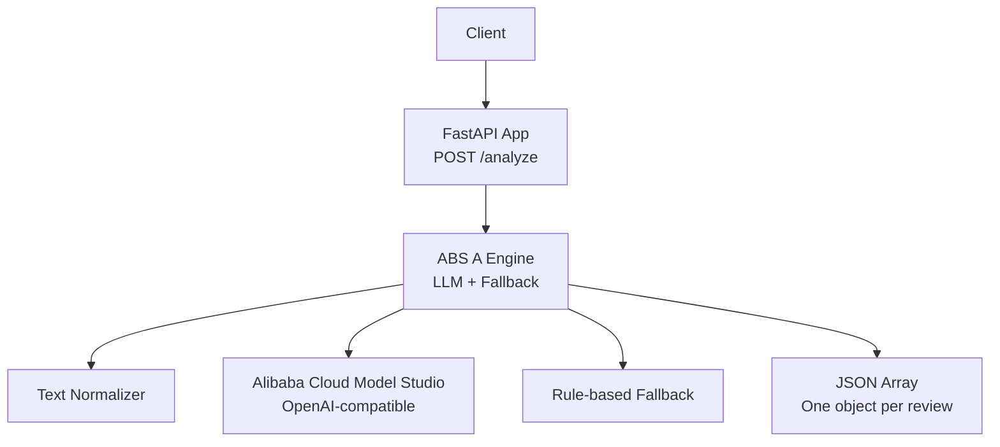
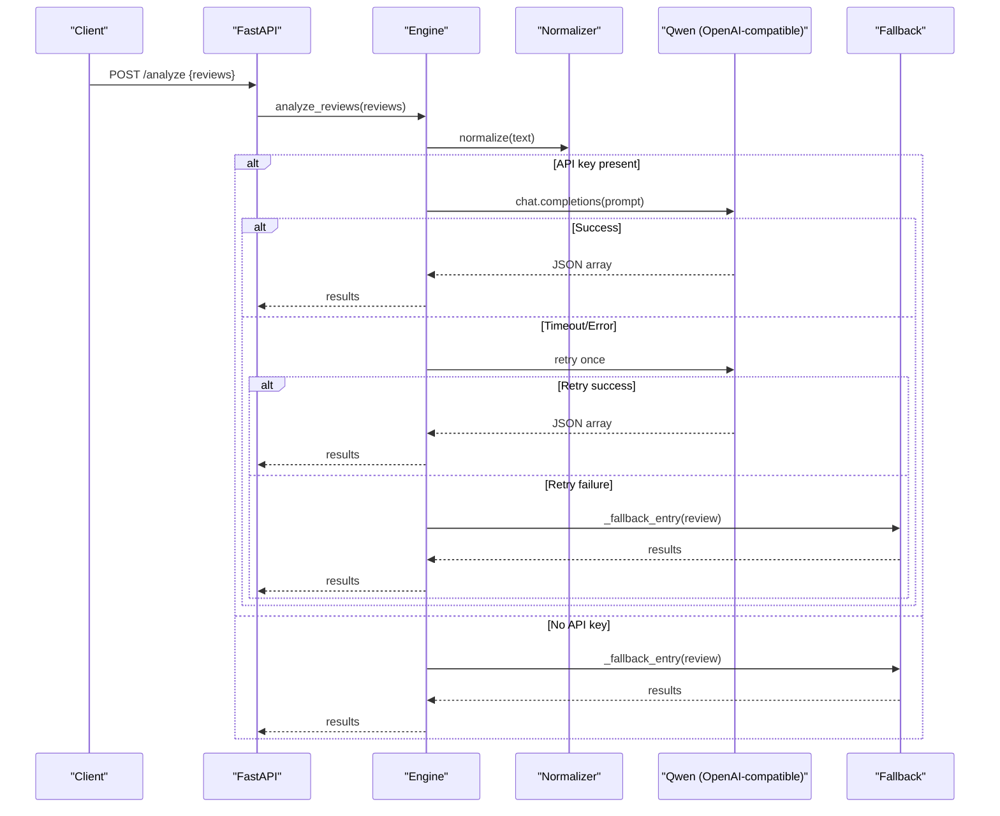
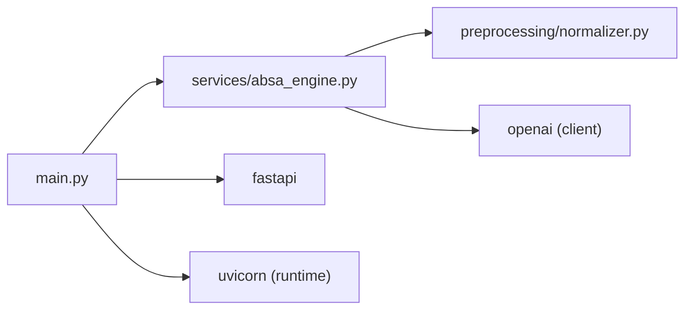

# Project Overview

<cite>
**Referenced Files in This Document**
- [main.py](file://main.py)
- [services/absa_engine.py](file://services/absa_engine.py)
- [preprocessing/normalizer.py](file://preprocessing/normalizer.py)
- [requirements.txt](file://requirements.txt)
- [wiki/Home.md](file://wiki/Home.md)
- [data/daraz_reviews_labeled.csv](file://data/daraz_reviews_labeled.csv)
</cite>

## Table of Contents
1. [Introduction](#introduction)
2. [Project Structure](#project-structure)
3. [Core Components](#core-components)
4. [Architecture Overview](#architecture-overview)
5. [Detailed Component Analysis](#detailed-component-analysis)
6. [Dependency Analysis](#dependency-analysis)
7. [Performance Considerations](#performance-considerations)
8. [Troubleshooting Guide](#troubleshooting-guide)
9. [Conclusion](#conclusion)

## Introduction
RAaye ABSA is a lightweight Aspect-Based Sentiment Analysis (ABSA) microservice designed for e-commerce reviews, with a focus on the Daraz marketplace. It supports multilingual inputs including English, Roman Urdu, and code-mixed text commonly found in South Asian online reviews. The system extracts product or service aspects (such as delivery, price, quality, packaging, functionality, seller service, and item-as-described) and assigns sentiment labels (positive, negative, neutral) along with confidence scores.

Key highlights:
- Dual-path processing: primary LLM-based analysis via Alibaba Cloud Model Studio (Qwen) with a compact few-shot prompt; automatic fallback to a rule-based keyword and lexicon engine when the LLM path fails or is unavailable.
- Batch processing: accepts up to 10 reviews per request, returning one result object per review in input order.
- Confidence scoring: each aspect includes a normalized confidence value between 0 and 1.
- Minimal deployment footprint: FastAPI server with environment-only configuration; no database or dashboard required.

Target audience:
- Developers integrating ABSA into e-commerce pipelines or review analytics systems.
- Data scientists and analysts working with multilingual customer feedback.
- E-commerce platforms seeking robust, resilient sentiment extraction for Daraz reviews.

Hackathon context:
- Built for Alibaba’s 2026 Hackathon as the ABSA core only, emphasizing rapid prototyping and practical resilience over heavy infrastructure.

[No sources needed since this section provides general project context]

## Project Structure
The repository is organized around a small, focused set of modules:
- main.py: FastAPI entry point exposing a single POST /analyze endpoint.
- services/absa_engine.py: Core ABSA logic, including LLM calls, retry, and rule-based fallback.
- preprocessing/normalizer.py: Rule-based normalizer for Roman Urdu/code-mixed text.
- requirements.txt: Runtime dependencies (FastAPI, Uvicorn, OpenAI client).
- data/daraz_reviews_labeled.csv: Dataset used for few-shot examples and contextual understanding.
- wiki/Home.md: Documentation describing API usage and internal workflow.

**Diagram sources**
- [main.py:16-36](file://main.py#L16-L36)
- [services/absa_engine.py:254-283](file://services/absa_engine.py#L254-L283)
- [preprocessing/normalizer.py:53-65](file://preprocessing/normalizer.py#L53-L65)

**Section sources**
- [main.py:1-37](file://main.py#L1-L37)
- [services/absa_engine.py:1-283](file://services/absa_engine.py#L1-L283)
- [preprocessing/normalizer.py:1-90](file://preprocessing/normalizer.py#L1-L90)
- [requirements.txt:1-4](file://requirements.txt#L1-L4)
- [wiki/Home.md:1-41](file://wiki/Home.md#L1-L41)

## Core Components
- FastAPI endpoint: Accepts a batch of reviews and returns structured ABSA results.
- ABSA engine: Orchestrates normalization, LLM call with retries, and rule-based fallback.
- Text normalizer: Cleans and canonicalizes Roman Urdu/code-mixed text to improve downstream performance.
- Configuration: Environment variables control model access and behavior without hardcoding secrets.

Key behaviors:
- Input validation enforces non-empty batches and maximum size.
- Normalization reduces noise and standardizes spelling variants.
- LLM path uses a few-shot prompt built from real code-mixed reviews to guide aspect extraction and sentiment labeling.
- Fallback path detects aspects via keywords and assigns polarity using positive/negative lexicons within a local window.

**Section sources**
- [main.py:23-36](file://main.py#L23-L36)
- [services/absa_engine.py:28-37](file://services/absa_engine.py#L28-L37)
- [services/absa_engine.py:129-140](file://services/absa_engine.py#L129-L140)
- [services/absa_engine.py:200-249](file://services/absa_engine.py#L200-L249)
- [preprocessing/normalizer.py:23-50](file://preprocessing/normalizer.py#L23-L50)
- [preprocessing/normalizer.py:53-65](file://preprocessing/normalizer.py#L53-L65)

## Architecture Overview
The system follows a resilient dual-path architecture:
- Primary path: Normalize text, build a few-shot prompt, call Qwen via OpenAI-compatible API with timeout and retry, parse JSON output, coerce entries, and return ordered results.
- Fallback path: If API key missing or both attempts fail, use keyword detection and lexicon-based polarity to produce results.

**Diagram sources**
- [main.py:32-36](file://main.py#L32-L36)
- [services/absa_engine.py:182-195](file://services/absa_engine.py#L182-L195)
- [services/absa_engine.py:254-283](file://services/absa_engine.py#L254-L283)

## Detailed Component Analysis

### FastAPI Endpoint
- Exposes POST /analyze accepting a list of reviews (1–10).
- Returns a JSON array where each element corresponds to one review with an aspects list containing aspect name, sentiment, and confidence.

Operational notes:
- Uses Pydantic model for request validation.
- Delegates processing to the ABSA engine.

**Section sources**
- [main.py:23-36](file://main.py#L23-L36)

### ABSA Engine
Responsibilities:
- Build user prompt with few-shot examples derived from labeled Daraz reviews.
- Call Qwen via OpenAI-compatible client with configured timeout and zero internal retries (handled by wrapper).
- Extract and validate JSON arrays from model output.
- Coerce per-review entries to standardized schema with normalized sentiments and bounded confidence values.
- Provide rule-based fallback when LLM path fails or is disabled.

Resilience:
- Configurable timeout and attempt count.
- Graceful degradation to keyword/lexicon fallback.

Few-shot strategy:
- Examples are curated from real code-mixed reviews to improve aspect extraction accuracy across languages.

**Section sources**
- [services/absa_engine.py:38-117](file://services/absa_engine.py#L38-L117)
- [services/absa_engine.py:129-140](file://services/absa_engine.py#L129-L140)
- [services/absa_engine.py:145-179](file://services/absa_engine.py#L145-L179)
- [services/absa_engine.py:182-195](file://services/absa_engine.py#L182-L195)
- [services/absa_engine.py:200-249](file://services/absa_engine.py#L200-L249)
- [services/absa_engine.py:254-283](file://services/absa_engine.py#L254-L283)

### Text Normalizer
Pipeline steps:
- Lowercase conversion.
- Noise removal: URLs, mentions, hashtags, punctuation, emoji, encoding artifacts.
- Collapse repeated characters.
- Canonicalize common phonetic spelling variants for Roman Urdu and e-commerce terms.

Impact:
- Improves consistency for downstream keyword matching and LLM prompting.
- Handles messy real-world review text typical of Daraz users.

**Section sources**
- [preprocessing/normalizer.py:1-9](file://preprocessing/normalizer.py#L1-L9)
- [preprocessing/normalizer.py:13-20](file://preprocessing/normalizer.py#L13-L20)
- [preprocessing/normalizer.py:23-50](file://preprocessing/normalizer.py#L23-L50)
- [preprocessing/normalizer.py:53-65](file://preprocessing/normalizer.py#L53-L65)

### Rule-based Fallback
Mechanism:
- Aspect detection via predefined regex patterns covering delivery, price, quality, packaging, product, item-as-described, seller service, and functionality.
- Polarity assignment using positive and negative lexicons within a ±8-token window around detected aspects.
- If no aspect keyword matches, compute overall polarity for the entire review.

Design rationale:
- Ensures service availability even when external models are unreachable or misbehave.
- Provides interpretable outputs grounded in explicit rules.

**Section sources**
- [services/absa_engine.py:200-249](file://services/absa_engine.py#L200-L249)

### Data and Few-shot Prompting
- Few-shot examples are sourced from data/daraz_reviews_labeled.csv, prioritizing visible Roman Urdu/code-mixed phrases to align with target domain language patterns.
- The dataset contains thousands of labeled reviews with positive, negative, and neutral sentiments, reflecting realistic distribution and challenges such as encoding corruption and duplicates.

Usage:
- Enhances LLM instruction-following for ABSA tasks in multilingual contexts.
- Grounds expected output format and aspect vocabulary.

**Section sources**
- [services/absa_engine.py:50-117](file://services/absa_engine.py#L50-L117)
- [wiki/Home.md:32-41](file://wiki/Home.md#L32-L41)
- [data/daraz_reviews_labeled.csv:1-200](file://data/daraz_reviews_labeled.csv#L1-L200)

## Dependency Analysis
External dependencies:
- FastAPI and Uvicorn for HTTP serving.
- OpenAI client for calling Alibaba Cloud Model Studio (Qwen) via OpenAI-compatible endpoint.

Internal coupling:
- main.py depends on services/absa_engine.py for business logic.
- services/absa_engine.py depends on preprocessing/normalizer.py for text cleaning.
- Configuration is decoupled via environment variables, minimizing runtime coupling.

Potential risks:
- External API availability and rate limits.
- Encoding issues in raw data handled by normalizer.

**Diagram sources**
- [main.py:7-13](file://main.py#L7-L13)
- [services/absa_engine.py:17-24](file://services/absa_engine.py#L17-L24)
- [requirements.txt:1-4](file://requirements.txt#L1-L4)

**Section sources**
- [requirements.txt:1-4](file://requirements.txt#L1-L4)
- [main.py:7-13](file://main.py#L7-L13)
- [services/absa_engine.py:17-24](file://services/absa_engine.py#L17-L24)

## Performance Considerations
- Batch size limit (up to 10) balances throughput and latency while keeping prompt sizes manageable.
- Timeout and retry strategy protects against transient failures without excessive resource consumption.
- Normalization reduces token noise, improving both LLM efficiency and fallback accuracy.
- Fallback avoids expensive model calls when necessary, ensuring responsiveness under degraded conditions.

[No sources needed since this section provides general guidance]

## Troubleshooting Guide
Common issues and resolutions:
- Missing API key: Service logs a warning and automatically falls back to rule-based processing.
- API timeouts or errors: Logs warnings during attempts; after retries, falls back to rule-based processing.
- Malformed model output: Parser raises errors; individual review coercion catches exceptions and triggers fallback for that review.
- Data encoding artifacts: Normalizer strips garbage characters; dataset inspection reveals replacement characters which are handled gracefully.

Operational tips:
- Ensure DASHSCOPE_API_KEY is set for full capability.
- Use uvicorn main:app --reload for local development.
- Validate input batch size and content before sending requests.

**Section sources**
- [services/absa_engine.py:263-283](file://services/absa_engine.py#L263-L283)
- [services/absa_engine.py:145-179](file://services/absa_engine.py#L145-L179)
- [wiki/Home.md:22-28](file://wiki/Home.md#L22-L28)
- [wiki/Home.md:32-41](file://wiki/Home.md#L32-L41)

## Conclusion
RAaye ABSA delivers a pragmatic, resilient ABSA solution tailored for multilingual e-commerce reviews on Daraz. Its dual-path design ensures high availability, while few-shot prompting and robust normalization improve accuracy across English, Roman Urdu, and code-mixed inputs. The minimal architecture makes it easy to deploy and integrate into existing review analytics pipelines, supporting developers, data scientists, and e-commerce platforms in extracting actionable insights from customer feedback.

[No sources needed since this section summarizes without analyzing specific files]