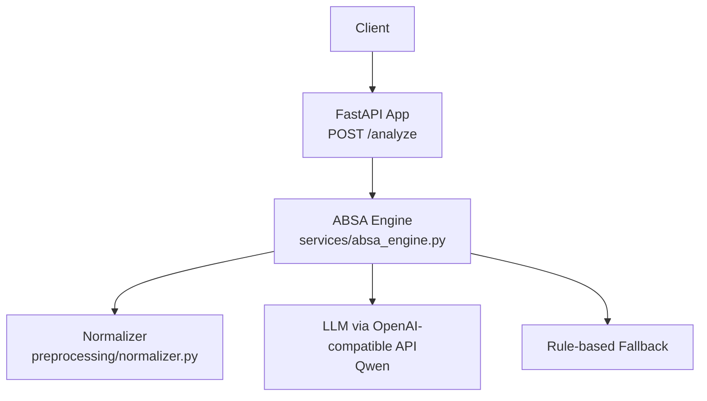
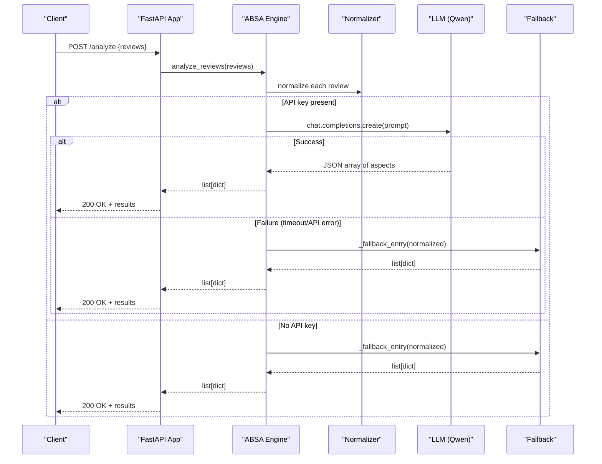
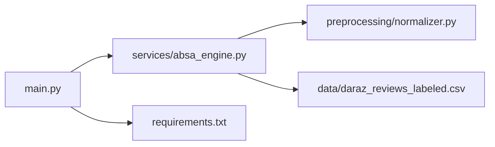

# Quick Start Guide

<cite>
**Referenced Files in This Document**
- [main.py](file://main.py)
- [requirements.txt](file://requirements.txt)
- [services/absa_engine.py](file://services/absa_engine.py)
- [preprocessing/normalizer.py](file://preprocessing/normalizer.py)
- [data/daraz_reviews_labeled.csv](file://data/daraz_reviews_labeled.csv)
- [wiki/Home.md](file://wiki/Home.md)
</cite>

## Table of Contents
1. [Introduction](#introduction)
2. [Project Structure](#project-structure)
3. [Core Components](#core-components)
4. [Architecture Overview](#architecture-overview)
5. [Detailed Component Analysis](#detailed-component-analysis)
6. [Dependency Analysis](#dependency-analysis)
7. [Performance Considerations](#performance-considerations)
8. [Troubleshooting Guide](#troubleshooting-guide)
9. [Conclusion](#conclusion)

## Introduction
This quick start guide helps you run the RAaye ABSA service locally and call its API to perform aspect-based sentiment analysis on e-commerce reviews written in English, Roman Urdu, or a code-mixed style. You will:
- Install dependencies using pip
- Set environment variables for LLM access
- Run the FastAPI server with uvicorn
- Call the /analyze endpoint with sample review data
- Understand development mode (rule-based fallback without an API key) and production mode (full LLM capabilities)

The service is intentionally minimal: one HTTP endpoint that returns structured results per input review.

## Project Structure
At a high level:
- main.py exposes the FastAPI app and the POST /analyze endpoint
- services/absa_engine.py implements the ABSA pipeline with LLM calls and a rule-based fallback
- preprocessing/normalizer.py cleans and normalizes reviews before analysis
- requirements.txt lists runtime dependencies
- data/daraz_reviews_labeled.csv contains labeled reviews used as few-shot examples in prompts
- wiki/Home.md provides concise project overview and API notes

**Diagram sources**
- [main.py:16-36](file://main.py#L16-L36)
- [services/absa_engine.py:254-282](file://services/absa_engine.py#L254-L282)
- [preprocessing/normalizer.py:53-65](file://preprocessing/normalizer.py#L53-L65)

**Section sources**
- [main.py:1-36](file://main.py#L1-L36)
- [requirements.txt:1-4](file://requirements.txt#L1-L4)
- [services/absa_engine.py:1-37](file://services/absa_engine.py#L1-L37)
- [preprocessing/normalizer.py:1-10](file://preprocessing/normalizer.py#L1-L10)
- [data/daraz_reviews_labeled.csv:1-5](file://data/daraz_reviews_labeled.csv#L1-L5)
- [wiki/Home.md:1-23](file://wiki/Home.md#L1-L23)

## Core Components
- FastAPI app and endpoint: defines request schema and routes to the engine
- ABSA engine: orchestrates normalization, optional LLM call, and fallback logic
- Normalizer: cleans text and maps common phonetic variants to canonical forms
- Data: few-shot examples embedded in the prompt are sourced from the labeled CSV

Key behaviors:
- Batch size limit enforced at the API layer and engine layer
- Environment-driven configuration for LLM access
- Graceful degradation to rule-based fallback when LLM is unavailable

**Section sources**
- [main.py:23-36](file://main.py#L23-L36)
- [services/absa_engine.py:28-37](file://services/absa_engine.py#L28-L37)
- [services/absa_engine.py:254-282](file://services/absa_engine.py#L254-L282)
- [preprocessing/normalizer.py:53-65](file://preprocessing/normalizer.py#L53-L65)

## Architecture Overview
The request flow:
1. Client sends POST /analyze with a list of reviews
2. FastAPI validates input and delegates to analyze_reviews
3. Reviews are normalized
4. If DASHSCOPE_API_KEY is set, attempt LLM call(s) with timeout and retry
5. On success, parse and coerce model output into standardized objects
6. On failure or if no API key is set, use rule-based fallback to produce results

**Diagram sources**
- [main.py:32-36](file://main.py#L32-L36)
- [services/absa_engine.py:182-195](file://services/absa_engine.py#L182-L195)
- [services/absa_engine.py:220-249](file://services/absa_engine.py#L220-L249)
- [services/absa_engine.py:254-282](file://services/absa_engine.py#L254-L282)

## Detailed Component Analysis

### Installation and Setup
- Create a virtual environment (recommended)
- Install dependencies:
  - Use pip to install from requirements.txt
- Verify installation by running the server once

Environment variables:
- DASHSCOPE_API_KEY: required for LLM mode; leave unset for development fallback
- QWEN_MODEL: optional; defaults to qwen-plus
- DASHSCOPE_BASE_URL: optional; defaults to the international OpenAI-compatible endpoint

Notes:
- Without DASHSCOPE_API_KEY, the service runs in development mode using rule-based fallback
- With DASHSCOPE_API_KEY set, the service uses full LLM capabilities with retries and timeouts

**Section sources**
- [requirements.txt:1-4](file://requirements.txt#L1-L4)
- [services/absa_engine.py:28-33](file://services/absa_engine.py#L28-L33)
- [wiki/Home.md:22-23](file://wiki/Home.md#L22-L23)

### Running the Service Locally
- Start the server in development mode with auto-reload:
  - Use uvicorn to serve main:app with reload enabled
- The server exposes:
  - POST /analyze accepting up to 10 reviews per call
  - Returns a JSON array with one result object per input review

Example usage:
- cURL example: send a POST request to http://127.0.0.1:8000/analyze with a JSON body containing a reviews array
- Python requests example: send a POST request to the same URL with a JSON payload

Expected response shape:
- An array where each element has an aspects field containing objects with aspect, sentiment, and confidence fields

**Section sources**
- [main.py:16-36](file://main.py#L16-L36)
- [wiki/Home.md:14-23](file://wiki/Home.md#L14-L23)

### Development Mode vs Production Mode
- Development mode (no API key):
  - Uses rule-based fallback to detect aspects and assign polarity based on keyword matching and lexicon scoring
  - Suitable for local testing and rapid iteration
- Production mode (with API key):
  - Uses Qwen via an OpenAI-compatible endpoint
  - Includes timeout handling and one retry per request
  - Provides richer aspect extraction and sentiment confidence scores

Behavioral differences:
- In development mode, results may be less nuanced but still useful for basic sentiment and aspect detection
- In production mode, expect higher quality outputs leveraging the LLM’s understanding of code-mixed language

**Section sources**
- [services/absa_engine.py:254-282](file://services/absa_engine.py#L254-L282)
- [services/absa_engine.py:182-195](file://services/absa_engine.py#L182-L195)
- [services/absa_engine.py:220-249](file://services/absa_engine.py#L220-L249)

### API Endpoint Details
- Endpoint: POST /analyze
- Request body:
  - reviews: array of strings (1–10 items)
- Response:
  - Array of objects, one per input review
  - Each object includes aspects: array of {aspect, sentiment, confidence}

Validation:
- Minimum and maximum batch sizes enforced
- Input is validated by the request model

Error handling:
- Invalid inputs raise validation errors
- LLM failures fall back to rule-based processing
- Timeout and network issues are handled with retries and logging

**Section sources**
- [main.py:23-36](file://main.py#L23-L36)
- [services/absa_engine.py:254-282](file://services/absa_engine.py#L254-L282)

### Data Preprocessing and Few-Shot Examples
- Normalization steps:
  - Lowercasing
  - Stripping URLs, mentions, emoji, punctuation, and encoding artifacts
  - Collapsing repeated characters
  - Mapping phonetic variants to canonical forms
- Few-shot examples:
  - Embedded in the prompt to guide the LLM
  - Sourced from the labeled dataset to reflect real code-mixed patterns

Why this matters:
- Improves robustness across noisy user-generated content
- Enhances consistency of extracted aspects and sentiments

**Section sources**
- [preprocessing/normalizer.py:1-10](file://preprocessing/normalizer.py#L1-L10)
- [preprocessing/normalizer.py:53-65](file://preprocessing/normalizer.py#L53-L65)
- [services/absa_engine.py:50-117](file://services/absa_engine.py#L50-L117)
- [data/daraz_reviews_labeled.csv:1-5](file://data/daraz_reviews_labeled.csv#L1-L5)

## Dependency Analysis
External dependencies:
- fastapi: web framework for the API
- uvicorn: ASGI server for running the app
- openai: client library for calling the OpenAI-compatible endpoint

Internal dependencies:
- main.py depends on services/absa_engine.py
- services/absa_engine.py depends on preprocessing/normalizer.py
- Prompt examples reference data/daraz_reviews_labeled.csv

**Diagram sources**
- [main.py:7-13](file://main.py#L7-L13)
- [services/absa_engine.py:17-25](file://services/absa_engine.py#L17-L25)
- [requirements.txt:1-4](file://requirements.txt#L1-L4)

**Section sources**
- [requirements.txt:1-4](file://requirements.txt#L1-L4)
- [main.py:7-13](file://main.py#L7-L13)
- [services/absa_engine.py:17-25](file://services/absa_engine.py#L17-L25)

## Performance Considerations
- Batch size:
  - Limit to 10 reviews per request to balance latency and throughput
- Timeouts and retries:
  - LLM calls include a timeout and one retry to handle transient failures
- Fallback efficiency:
  - Rule-based fallback avoids external calls and reduces latency when LLM is unavailable
- Text normalization:
  - Reduces noise and improves both LLM and fallback performance

Recommendations:
- Keep payloads within the batch limit
- Monitor logs for LLM failures and adjust timeouts if needed
- Consider caching frequent queries in front-end or gateway layers if applicable

[No sources needed since this section provides general guidance]

## Troubleshooting Guide
Common issues and resolutions:
- Missing API key:
  - Symptom: service runs in development mode with rule-based fallback
  - Resolution: set DASHSCOPE_API_KEY to enable LLM mode
- LLM timeout or network error:
  - Symptom: warnings in logs; results come from fallback
  - Resolution: check network connectivity and base URL; verify rate limits and quotas
- Invalid request:
  - Symptom: validation error for empty or oversized reviews array
  - Resolution: ensure 1–10 reviews per request
- Encoding issues in data:
  - Symptom: replacement characters in raw data
  - Resolution: normalizer strips noise; no action required for API usage

Where to look:
- Logs indicate when fallback is used and why
- Engine handles exceptions and logs attempts and failures

**Section sources**
- [services/absa_engine.py:254-282](file://services/absa_engine.py#L254-L282)
- [services/absa_engine.py:182-195](file://services/absa_engine.py#L182-L195)
- [preprocessing/normalizer.py:53-65](file://preprocessing/normalizer.py#L53-L65)

## Conclusion
You now have everything needed to run the RAaye ABSA service locally, configure it for development or production, and call the /analyze endpoint to extract aspects and sentiments from reviews. Start in development mode to iterate quickly, then enable LLM capabilities by setting your API key for richer results.

[No sources needed since this section summarizes without analyzing specific files]