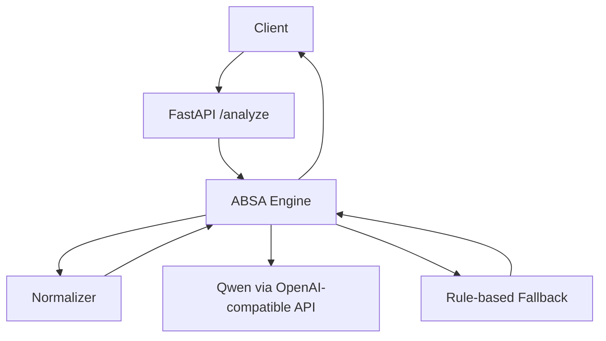
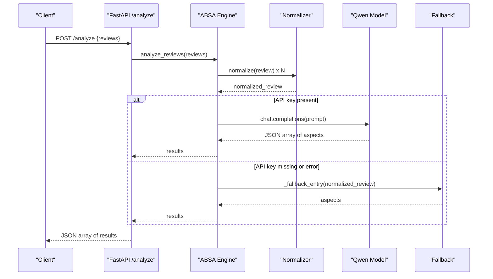
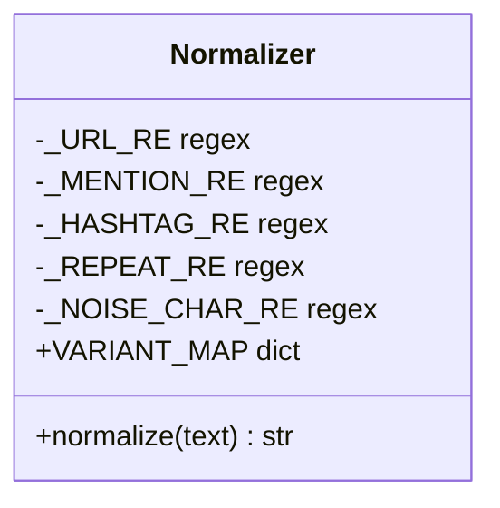
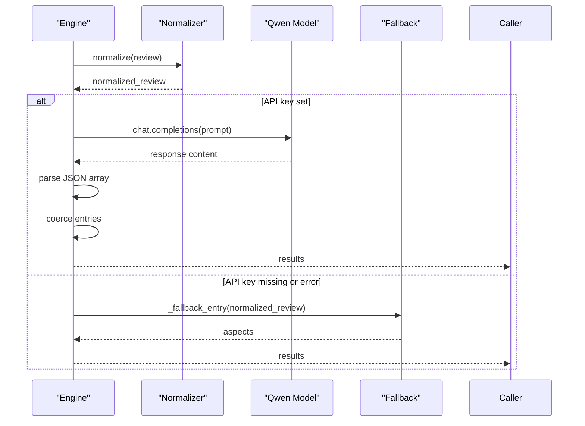
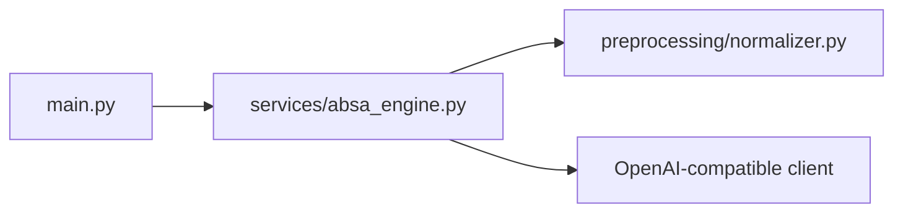

# Text Processing Pipeline

<cite>
**Referenced Files in This Document**
- [normalizer.py](file://preprocessing/normalizer.py)
- [absa_engine.py](file://services/absa_engine.py)
- [main.py](file://main.py)
- [requirements.txt](file://requirements.txt)
- [Home.md](file://wiki/Home.md)
- [daraz_reviews_labeled.csv](file://data/daraz_reviews_labeled.csv)
</cite>

## Table of Contents
1. [Introduction](#introduction)
2. [Project Structure](#project-structure)
3. [Core Components](#core-components)
4. [Architecture Overview](#architecture-overview)
5. [Detailed Component Analysis](#detailed-component-analysis)
6. [Dependency Analysis](#dependency-analysis)
7. [Performance Considerations](#performance-considerations)
8. [Troubleshooting Guide](#troubleshooting-guide)
9. [Conclusion](#conclusion)
10. [Appendices](#appendices)

## Introduction
This document explains the text processing pipeline that powers multilingual text normalization for Roman Urdu and code-mixed e-commerce reviews. It focuses on preprocessing steps such as noise reduction (URL stripping, mention removal, emoji cleanup), character normalization (repeated character collapse, encoding fixes), and phonetic variant mapping for Roman Urdu. It also documents the normalizer module’s functions and parameters, provides before/after transformation examples, discusses challenges with code-mixed languages, outlines the lexicon-based mapping system, and offers guidelines to extend normalization rules. Finally, it covers performance considerations and optimization techniques for large-scale text processing.

## Project Structure
The repository implements a minimal FastAPI service that:
- Accepts batches of raw reviews via an HTTP endpoint.
- Normalizes each review using a rule-based normalizer tailored for Roman Urdu and code-mixed text.
- Performs aspect-based sentiment analysis using a language model with a robust fallback to rule-based heuristics when the model is unavailable or returns malformed output.

**Diagram sources**
- [main.py:16-36](file://main.py#L16-L36)
- [absa_engine.py:254-282](file://services/absa_engine.py#L254-L282)
- [normalizer.py:53-65](file://preprocessing/normalizer.py#L53-L65)

**Section sources**
- [main.py:1-36](file://main.py#L1-L36)
- [Home.md:7-28](file://wiki/Home.md#L7-L28)

## Core Components
- Normalizer: A rule-based text cleaner and canonicalizer for Roman Urdu/code-mixed reviews. It lowercases text, strips noise, collapses repeated characters, and maps common phonetic variants to canonical forms.
- ABSA Engine: Orchestrates normalization, calls a language model with few-shot prompts, parses and validates outputs, and falls back to keyword-based aspect detection and polarity scoring when needed.
- API Layer: Exposes a single POST endpoint that accepts up to a fixed batch size of reviews and returns one result object per input review.

Key responsibilities:
- Noise reduction: URLs, mentions, hashtags, punctuation, emoji, and encoding garbage are removed or normalized.
- Character normalization: Repeated characters are collapsed; underscores are converted to spaces; tokens are split and mapped through a phonetic variant dictionary.
- Lexicon mapping: A curated dictionary maps frequent Roman Urdu misspellings and abbreviations to canonical words, including e-commerce vocabulary.

**Section sources**
- [normalizer.py:13-65](file://preprocessing/normalizer.py#L13-L65)
- [absa_engine.py:24-282](file://services/absa_engine.py#L24-L282)
- [main.py:23-36](file://main.py#L23-L36)

## Architecture Overview
The pipeline processes each review through normalization before invoking the ABSA engine. The engine attempts a model call with retries and then applies a rule-based fallback if necessary.

**Diagram sources**
- [main.py:32-36](file://main.py#L32-L36)
- [absa_engine.py:254-282](file://services/absa_engine.py#L254-L282)
- [normalizer.py:53-65](file://preprocessing/normalizer.py#L53-L65)

## Detailed Component Analysis

### Normalizer Module
The normalizer implements a deterministic, regex-driven pipeline designed for noisy, code-mixed text typical of e-commerce reviews.

Pipeline steps:
- Lowercasing: Ensures consistent tokenization and mapping.
- Noise reduction:
  - URL stripping: Removes http/https links and www-prefixed domains.
  - Mention removal: Strips @mentions.
  - Hashtag handling: Keeps the word inside # but removes the symbol.
  - Punctuation/emoji/garbage removal: Removes non-word/non-space/non-apostrophe characters, including U+FFFD replacement characters caused by encoding corruption.
  - Underscore normalization: Converts underscores to spaces to avoid merging tokens.
- Repeated character collapse: Reduces runs of three or more identical characters to a single character (e.g., “bohoooot” → “bohot”).
- Phonetic variant mapping: Uses a dictionary to map common Roman Urdu and e-commerce misspellings/abbreviations to canonical forms. Examples include intensifiers (“bohot”, “bahut”, “bht” → “bohat”), descriptors (“achha”, “accha” → “acha”), negation (“nhi”, “nahin” → “nahi”), copula (“hain”, “hy” → “hai”), and e-commerce terms (“delivry”, “qlty”, “parxel” → “delivery”, “quality”, “parcel”).

Function signature and behavior:
- Function: normalize(text: str) -> str
- Parameters:
  - text: Raw review string. Empty strings return empty strings.
- Returns:
  - Cleaned, lowercase, canonicalized text with normalized spacing.

Before/After examples (described):
- Repeated characters + intensifier: Input contains elongated words and Roman Urdu intensifiers; output collapses repeats and maps to canonical forms.
- Abbreviations + commerce terms: Input includes short forms like “qlty” and “bht”; output expands to “quality” and “bohat”.
- Noise stripping: Input includes URLs, mentions, emojis, and punctuation; output removes these artifacts while preserving meaningful words.
- Encoding garbage: Input contains replacement characters from corrupted encodings; output strips them and preserves readable tokens.

Extending the normalizer:
- Add new patterns to the regex set for additional noise types (e.g., phone numbers, specific domain patterns).
- Expand VARIANT_MAP with new phonetic variants, abbreviations, or domain-specific terms.
- Introduce token-level filters (e.g., stopword removal) if downstream models benefit from reduced noise.
- Consider locale-aware stemming or lemmatization for Roman Urdu if needed.

Complexity:
- Time complexity: O(n) per review where n is the number of characters/tokens, due to linear regex passes and dictionary lookups.
- Space complexity: O(n) for intermediate strings and token lists.

Error handling:
- Handles empty inputs gracefully.
- Regex substitutions are safe and do not raise exceptions on malformed text.

**Section sources**
- [normalizer.py:13-65](file://preprocessing/normalizer.py#L13-L65)
- [normalizer.py:70-89](file://preprocessing/normalizer.py#L70-L89)

#### Class and Data Structures
While the normalizer is function-based rather than class-based, its core data structure is a mapping dictionary used for phonetic normalization.

**Diagram sources**
- [normalizer.py:13-65](file://preprocessing/normalizer.py#L13-L65)

### ABSA Engine
The ABSA engine coordinates normalization, model inference, parsing, validation, and fallback logic.

Key responsibilities:
- Batch constraints: Enforces maximum batch size and non-empty input validation.
- Normalization: Applies the normalizer to each review before prompting the model.
- Model call: Constructs a prompt with few-shot examples and sends it to Qwen via an OpenAI-compatible client with timeout and retry configuration.
- Output parsing: Extracts JSON arrays from model responses, coerces entries into a standardized schema, and handles malformed outputs by falling back to rules.
- Rule-based fallback: Detects aspects using keyword patterns and assigns sentiment based on positive/negative lexicons within a local window around aspect keywords.

Prompt construction:
- System prompt defines the task and expected output format.
- Few-shot examples are drawn from real code-mixed reviews to guide the model’s behavior.
- User prompt enumerates the normalized reviews and requests a JSON array of results matching input order.

Parsing and coercion:
- Extracts JSON arrays even if wrapped in markdown fences.
- Validates each entry’s aspect, sentiment, and confidence fields; defaults to neutral sentiments and reasonable confidence values when invalid.

Fallback details:
- Aspect detection uses predefined regex patterns for categories like delivery, price, quality, packaging, product, item-as-described, seller service, and functionality.
- Sentiment assignment counts positive and negative keywords within a ±8-token window around the detected aspect; majority determines sentiment; ties yield neutral.

Configuration:
- Environment variables control API key, base URL, model name, timeout, and retry count.
- Without an API key, the engine logs a warning and uses the rule-based fallback for all reviews.

**Section sources**
- [absa_engine.py:1-282](file://services/absa_engine.py#L1-L282)

#### Sequence Diagram: Model Call and Fallback

**Diagram sources**
- [absa_engine.py:129-195](file://services/absa_engine.py#L129-L195)
- [absa_engine.py:220-249](file://services/absa_engine.py#L220-L249)
- [absa_engine.py:254-282](file://services/absa_engine.py#L254-L282)

### API Layer
The FastAPI application exposes a single endpoint:
- Endpoint: POST /analyze
- Request body: JSON object with a “reviews” field containing 1–10 review strings.
- Response: JSON array of objects, one per input review, each containing an “aspects” list with aspect, sentiment, and confidence.

Validation:
- Pydantic enforces minimum and maximum lengths for the reviews list.
- The engine raises errors for empty or oversized batches.

**Section sources**
- [main.py:23-36](file://main.py#L23-L36)

## Dependency Analysis
The system has clear layering:
- API depends on the ABSA engine.
- ABSA engine depends on the normalizer and external model client.
- Normalizer has no internal dependencies beyond standard library modules.

**Diagram sources**
- [main.py:7-12](file://main.py#L7-L12)
- [absa_engine.py:17-24](file://services/absa_engine.py#L17-L24)
- [requirements.txt:1-4](file://requirements.txt#L1-L4)

**Section sources**
- [requirements.txt:1-4](file://requirements.txt#L1-L4)
- [main.py:7-12](file://main.py#L7-L12)
- [absa_engine.py:17-24](file://services/absa_engine.py#L17-L24)

## Performance Considerations
- Normalization efficiency:
  - Regex operations run in linear time relative to input length; batching multiple reviews reduces overhead.
  - Dictionary lookups for variant mapping are O(1) average-case.
  - Avoid excessive regex recompilation by keeping compiled patterns at module scope.
- Model call optimization:
  - Batch up to the configured maximum to reduce network round-trips.
  - Use timeouts and retries to prevent hanging requests; ensure logging captures failures for observability.
  - Cache prompt templates and few-shot blocks to avoid recomputation across calls.
- Fallback performance:
  - Keyword scanning uses precompiled regexes; keep pattern sets concise to minimize false positives.
  - Limit window sizes for sentiment scoring to balance accuracy and speed.
- Memory usage:
  - Process reviews in streams or chunks when possible to avoid loading entire datasets into memory.
  - Normalize once per review and reuse results for both model and fallback paths.

[No sources needed since this section provides general guidance]

## Troubleshooting Guide
Common issues and resolutions:
- Missing API key:
  - Symptom: Engine logs a warning and uses rule-based fallback for all reviews.
  - Resolution: Set DASHSCOPE_API_KEY environment variable to enable model-based analysis.
- Malformed model output:
  - Symptom: Parsing fails or entries lack required fields.
  - Resolution: Engine coerces invalid entries to safe defaults and logs warnings; verify prompt and few-shot examples; consider post-processing to clean model responses.
- Encoding corruption in input data:
  - Symptom: Replacement characters (U+FFFD) appear in reviews.
  - Resolution: Normalizer strips non-word/non-space/non-apostrophe characters, including U+FFFD; ensure input files are decoded safely and consider pre-normalization checks.
- Duplicate or truncated reviews:
  - Symptom: Data contains duplicates or cut-off texts.
  - Resolution: Deduplicate upstream; handle truncation by allowing flexible aspect detection; monitor metrics for impact on accuracy.

**Section sources**
- [absa_engine.py:263-282](file://services/absa_engine.py#L263-L282)
- [Home.md:32-41](file://wiki/Home.md#L32-L41)

## Conclusion
The text processing pipeline combines robust rule-based normalization with model-assisted aspect-based sentiment analysis, providing resilience through a well-designed fallback mechanism. The normalizer addresses the unique challenges of code-mixed Roman Urdu text by systematically reducing noise, collapsing repeated characters, and mapping phonetic variants to canonical forms. The ABSA engine orchestrates normalization, model inference, parsing, and fallback logic, ensuring reliable operation even under adverse conditions. Extensibility is straightforward via regex updates and dictionary expansions, while performance can be optimized through batching, caching, and efficient regex usage.

[No sources needed since this section summarizes without analyzing specific files]

## Appendices

### Lexicon Mapping System for Phonetic Variants
The normalizer’s VARIANT_MAP serves as the core lexicon for phonetic normalization. It includes:
- Intensifiers: Multiple spellings of “very” mapped to a canonical form.
- Descriptors: Common adjectives and their variants normalized to standard forms.
- Negation and copula: Frequent negations and verb forms mapped consistently.
- E-commerce vocabulary: Misspelled or abbreviated terms related to delivery, quality, packaging, pricing, and seller interactions.

Guidelines for extension:
- Add entries for emerging slang or platform-specific jargon observed in new data.
- Group related variants logically to aid maintenance and testing.
- Validate mappings against representative samples to avoid over-normalization.
- Consider context-aware mappings if certain variants change meaning depending on surrounding tokens.

**Section sources**
- [normalizer.py:23-50](file://preprocessing/normalizer.py#L23-L50)

### Before/After Transformation Examples
Examples illustrate how the normalizer transforms various input types:
- Elongated words and intensifiers: Repeated characters are collapsed; Roman Urdu intensifiers are mapped to canonical forms.
- Abbreviations and commerce terms: Short forms expand to full words recognized by downstream components.
- Noise-heavy text: URLs, mentions, emojis, and punctuation are stripped, leaving clean tokens.
- Encoding-corrupted text: Garbage characters are removed, preserving readable content.

These transformations improve consistency and reduce noise for both model-based and rule-based analysis.

**Section sources**
- [normalizer.py:70-89](file://preprocessing/normalizer.py#L70-L89)

### Challenges of Code-Mixed Languages
Code-mixed reviews combine English and Roman Urdu, introducing:
- Spelling variations and phonetic spellings requiring robust mapping.
- Mixed scripts and encoding issues causing replacement characters.
- Domain-specific terminology that may be misspelled or abbreviated.
- Context-dependent sentiment signals that require careful windowing and lexicon coverage.

The system addresses these challenges through:
- Comprehensive noise reduction and character normalization.
- A curated phonetic variant dictionary covering common patterns.
- Flexible fallback mechanisms that rely on keyword detection and polarity lexicons.
- Few-shot prompting with real code-mixed examples to guide model behavior.

**Section sources**
- [absa_engine.py:40-117](file://services/absa_engine.py#L40-L117)
- [absa_engine.py:200-249](file://services/absa_engine.py#L200-L249)
- [Home.md:32-41](file://wiki/Home.md#L32-L41)